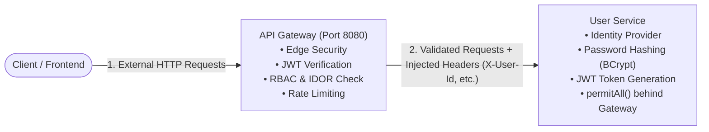
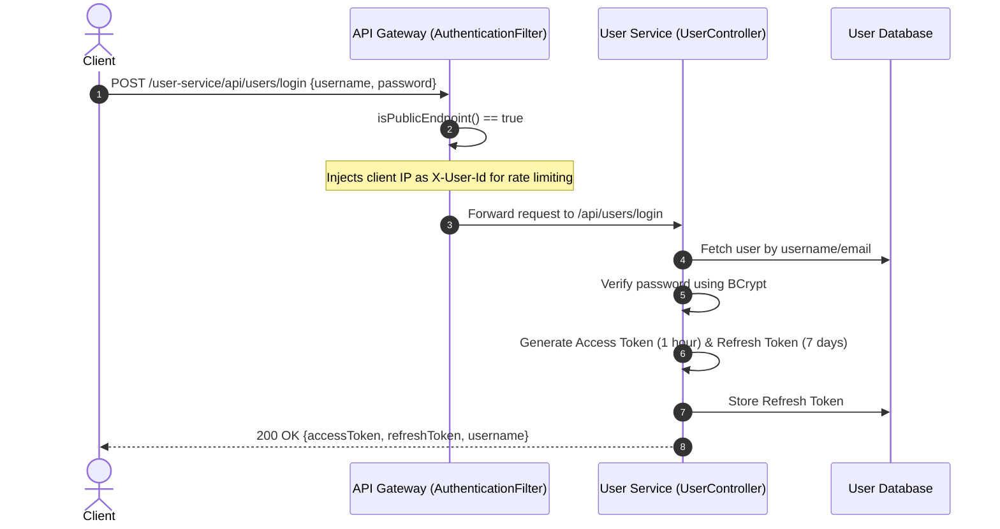
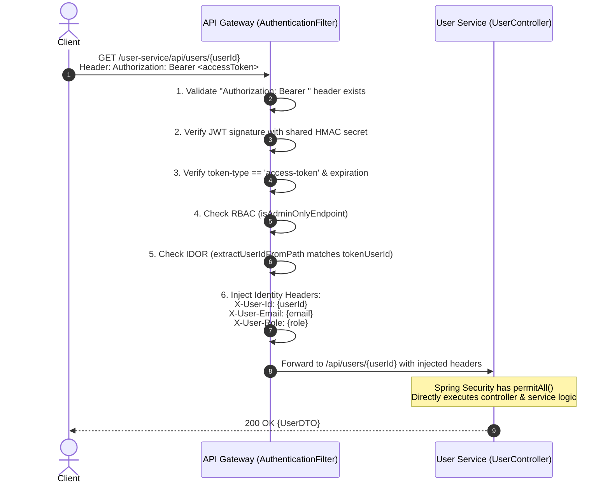
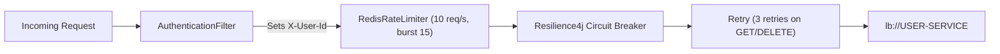

# Security Architecture: API Gateway & User Service

This document provides a comprehensive reference on how security, authentication, and authorization are handled between the **API Gateway** and **User Service** in the EasyBuy MicroDevops project.

---

## 1. High-Level Architectural Pattern

The project implements the **Perimeter Gatekeeper Pattern** (also known as the *Trusted Subsystem* or *Edge Security Pattern*):



### Core Responsibilities

| Component | Responsibility | Relevant Classes |
| :--- | :--- | :--- |
| **API Gateway** | • Edge Gatekeeper / Single Entrypoint<br>• Public vs Protected Route Filtering<br>• JWT Signature & Expiry Verification<br>• Role-Based Access Control (RBAC)<br>• Anti-IDOR (Object Ownership Verification)<br>• Identity Propagation (`X-User-*` headers)<br>• Redis Rate Limiting | `AuthenticationFilter.java`<br>`APIGatewayConfiguration.java` |
| **User Service** | • User Registration & Password Hashing (`BCrypt`)<br>• User Authentication (`AuthenticationManager`)<br>• Token Issuance (Access Token & Refresh Token)<br>• Refresh Token Persistence & Rotation<br>• Internal endpoints configured with `permitAll()` | `SecurityConfig.java`<br>`JWTService.java`<br>`UserController.java`<br>`UserServiceImplementation.java` |

---

## 2. Complete Security Workflows

### Flow 1: Authentication & Token Issuance (Login)

When a user logs in or registers, the API Gateway detects that the path is public, allows it through, and `user-service` issues the signed JWT.



---

### Flow 2: Accessing Protected Endpoints (Profile, Cart, Orders)

For secured endpoints, the API Gateway performs all cryptographic checks, RBAC authorization, and IDOR prevention before downstream microservices ever see the request.



---

## 3. Deep Dive: Gateway Security Mechanism

Located in: `com.easybuy.api_gateway.filter.AuthenticationFilter`

### 1. Public Endpoint Whitelist (`isPublicEndpoint`)
Requests matching these routes bypass JWT verification:
- `/public/**`
- `/api/users/login` (Authentication)
- `/api/users/refresh` (Token refresh)
- `POST /api/users` (User registration)
- Public catalogue reads: `GET /product/**`, `GET /category/**`, `GET /review/**`

For public routes, the client's IP is extracted and set as `X-User-Id` to allow IP-based rate limiting:
```java
String clientIp = request.getRemoteAddress() != null
        ? request.getRemoteAddress().getAddress().getHostAddress()
        : "anonymous";
ServerHttpRequest mutatedRequest = prepareHeader(request, clientIp, null, null);
```

### 2. JWT Verification
For all other routes, the `Authorization` header is extracted and validated:
1. **Signature Verification**: Verified against the shared secret key using HMAC-SHA.
2. **Token Type Check**:
   ```java
   if (!type.equalsIgnoreCase("access-token")) 
       return onError(exchange, "Refresh token is not acceptable.", HttpStatus.UNAUTHORIZED);
   ```
3. **Expiry Check**:
   ```java
   if (expiration.before(new Date())) 
       return onError(exchange, "JWT Token Expired", HttpStatus.UNAUTHORIZED);
   ```
4. **Role Validation**:
   Must match `ADMIN`, `USER`, or `GUEST`.

### 3. Role-Based Access Control (RBAC)
Methods like `isAdminOnlyEndpoint(path, method)` protect administrative routes:
- `/api/users/change-role`
- `GET /api/users` (fetching all users, excluding individual profile lookups)
- Non-GET operations on `/product`, `/category`, `/review`
- Non-GET operations on `/api/inventories`

If a user does not have role `ADMIN`, the gateway immediately rejects the request with HTTP `401/403`.

### 4. Ownership Verification (Anti-IDOR)
To prevent Insecure Direct Object Reference (e.g. user `123` trying to read or delete profile `456`):
```java
if (isUserOrGuest(tokenRole)) {
    String targetUserId = extractUserIdFromPath(path);
    if (targetUserId != null && !targetUserId.equalsIgnoreCase(tokenUserId)) {
        return onError(exchange, "Forbidden : You cannot access another user's data.", HttpStatus.UNAUTHORIZED);
    }
}
```

### 5. Identity Header Propagation
Once validated, the gateway injects trusted request headers to downstream services:
- `X-User-Id`: Extracted from JWT claim `userId`
- `X-User-Email`: Extracted from JWT subject
- `X-User-Role`: Extracted from JWT claim `role`

---

## 4. Deep Dive: User Service Security Mechanism

### 1. Spring Security Configuration (`SecurityConfig.java`)
Because the API Gateway guards the perimeter, `user-service` disables local session tracking and allows all inbound requests that reach it:

```java
@Configuration
@EnableWebSecurity
public class SecurityConfig {

    @Bean
    public SecurityFilterChain customSpringSecurityFilterChain(HttpSecurity http) throws Exception {
        return http
                .csrf(AbstractHttpConfigurer::disable)
                .sessionManagement(sessionManagement ->
                        sessionManagement.sessionCreationPolicy(SessionCreationPolicy.STATELESS))
                .authorizeHttpRequests(authorizeRequests ->
                        authorizeRequests.anyRequest().permitAll()
                ).build();
    }
}
```

### 2. Token Generation (`JWTService.java`)
- **Algorithm**: HMAC-SHA256 (`Keys.hmacShaKeyFor(secretKeyBytes)`).
- **Access Token Claims**:
  - `subject`: User email
  - `userId`: User UUID
  - `role`: Role enum (`ADMIN`, `USER`, `GUEST`)
  - `token-type`: `"access-token"`
  - `issuedAt` & `expiration` (default: 1 hour)
- **Refresh Token Claims**:
  - `token-type`: `"refresh-token"`
  - `expiration`: 7 days
  - Stored in the `refresh_tokens` database table and rotated on each refresh.

---

## 5. Rate Limiting & Resilience at Gateway

Configured in `APIGatewayConfiguration.java`:



- **Key Resolver**: Uses the `X-USER-ID` header set by `AuthenticationFilter`. This ensures every user (or anonymous IP) has their own Redis rate limit bucket.
- **Circuit Breaker**: If `user-service` fails or times out, calls are diverted to `/user-service-fallback`.
- **Retry**: Transparently retries idempotent methods (GET, DELETE) up to 3 times with exponential backoff.

---

## 6. Shared Secret Configuration

Both `api-gateway` and `user-service` share the identical JWT signing key:

```properties
jwt.secret-key=eyJhbGciOiJIUzI1NiIsInR5cCI6IkpXVCJ9/eyJzdWIiOiI4ZjQxYzY0Yi0yYjY0LTQ2NWEtYjM4Ny0zYjQ5YjQ5MjA1YzAiLCJuYW1lIjoiVGVzdCBVc2VyIiwiaWF0IjoxNzgyMTQ1NjAwfQ=v4sV1v6x4z9H7N4uK8cQmJ5Wf2YtR1nP3sE6dL0aB9Q
```

In production, this key should be supplied securely via **Spring Cloud Config Server** or environment secrets (`secrets.env` / Kubernetes Secrets).

---

## 7. Security Best Practices & Recommendations

1. **Network Isolation**: Ensure `user-service` is in a private network or private Kubernetes subnet so external clients cannot bypass the API Gateway to hit `user-service` directly (which has `permitAll()`).
2. **Mutual TLS (mTLS) or Gateway Secret**: For defense-in-depth, configure a shared internal header (e.g., `X-Gateway-Secret`) or mTLS between API Gateway and downstream services to reject any calls not originating from the gateway.
3. **Asymmetric Key Pairs (RSA / EC)**: Consider transitioning from HMAC symmetric key (shared secret) to RSA/ECDSA public-private key pairs:
   - `user-service` signs tokens using its **private key**.
   - `api-gateway` verifies tokens using the **public key** without needing the signing key.
