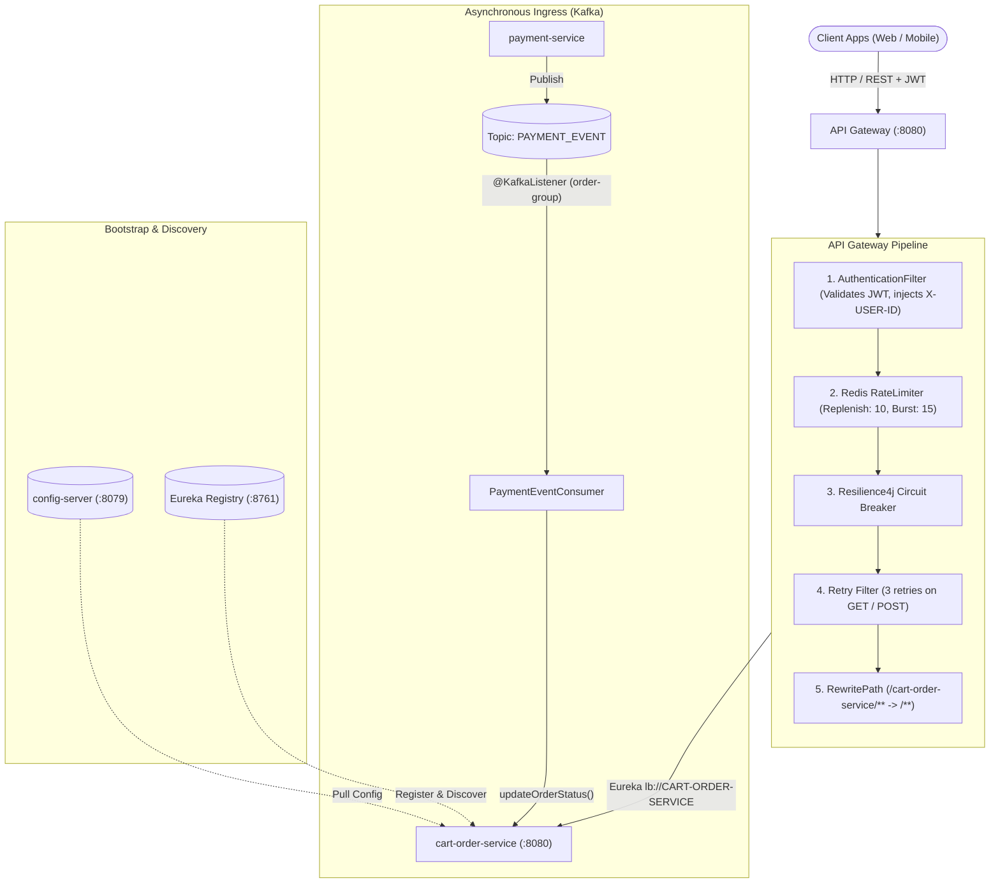
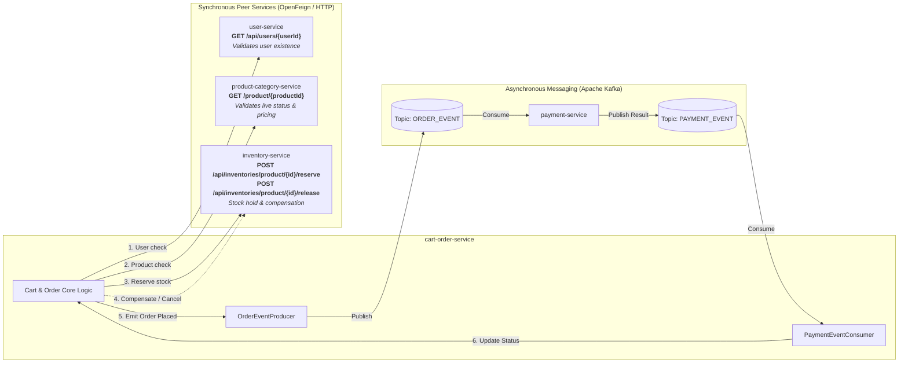
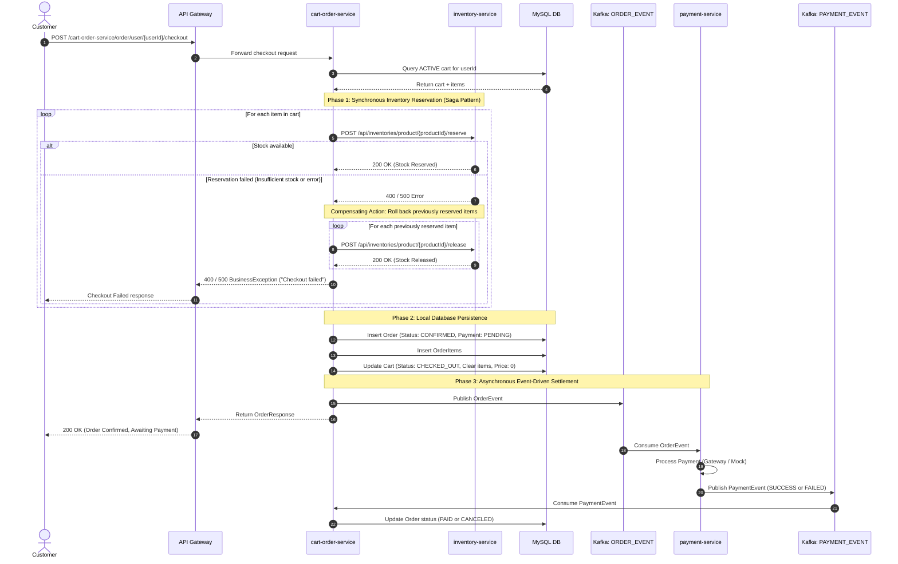
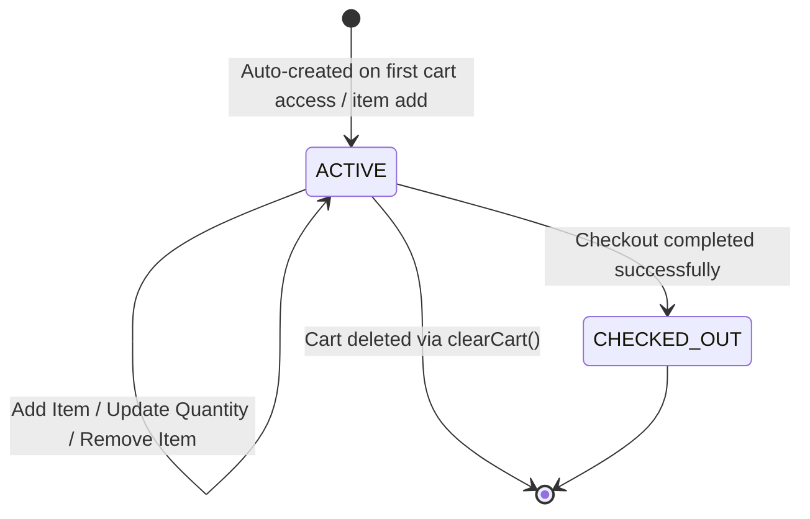
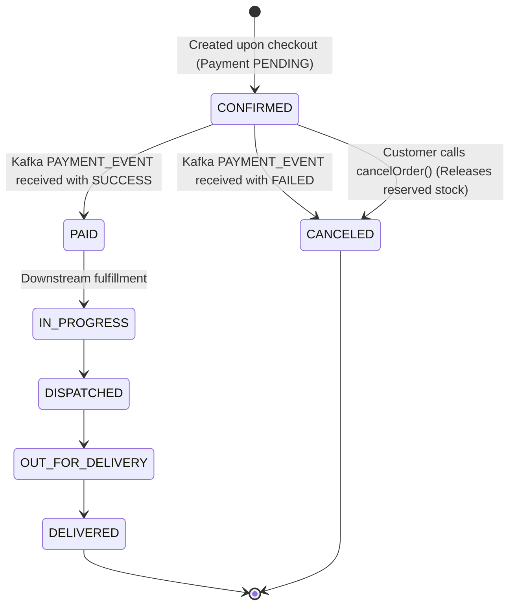
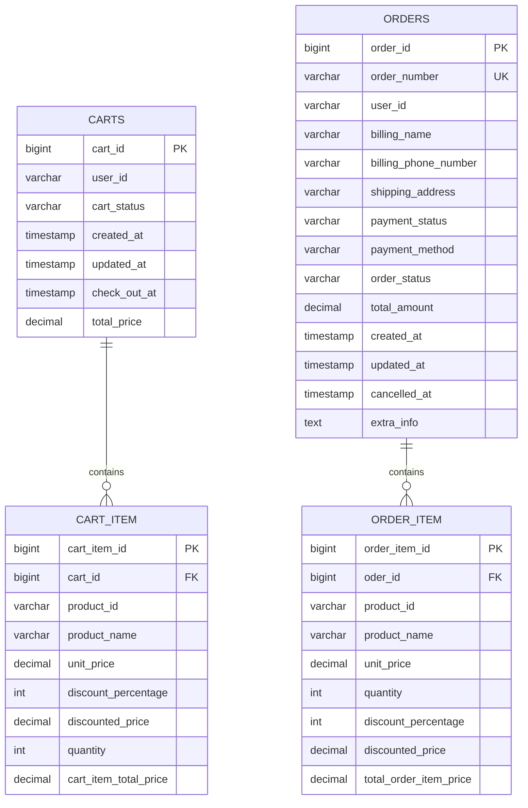

# EasyBuy — Cart & Order Service (`cart-order-service`)

A resilient e-commerce microservice responsible for **shopping cart management**, **order lifecycle orchestration**, **synchronous inventory reservation with compensating rollbacks**, and **asynchronous event-driven payment settlement**.

---

## 1. What This Microservice Does

- **Shopping Cart Management**:
  - Manages persistent per-user shopping carts in MySQL.
  - Automatically provisions an `ACTIVE` cart when requested if none exists.
  - Adds items, updates quantities, removes items, and recalculates line-item and cart total prices.
  - Validates live product eligibility, unit prices, and discounts at the time of cart modification.
- **Order Creation & Checkout**:
  - Converts active cart contents into an immutable order with a generated UUID `orderNumber`.
  - Coordinates multi-item stock reservation with [`inventory-service`](file:///Users/canzova/IdeaProjects/MicroDevops/inventory-service).
  - Implements **Saga compensation**: if any product's stock reservation fails during checkout, previously reserved items in that transaction are rolled back/released.
  - Marks cart as `CHECKED_OUT`, flushes cart items, and resets cart total price.
- **Order Lifecycle & Management**:
  - Supports order lookup by numeric ID, UUID order number, or by user ID.
  - Handles order cancellations, triggering inventory release for all items in that order.
- **Event-Driven Payment Settlement**:
  - Publishes `OrderEvent` to Kafka topic `ORDER_EVENT` for downstream processing by [`payment-service`](file:///Users/canzova/IdeaProjects/MicroDevops/payment-service).
  - Listens to Kafka topic `PAYMENT_EVENT` to update order payment and fulfillment statuses.

---

## 2. Inbound Requests & Ingress Architecture

Where do requests originate, and how do they reach `cart-order-service`?

### Ingress Points Summary
1. **HTTP Inbound (via API Gateway)**:
   - Route path: `/cart-order-service/**`
   - Stripped prefix: Rewritten to `/**` (e.g. `/cart-order-service/cart/user/{id}` $\rightarrow$ `/cart/user/{id}`)
   - Gateway Filters applied:
     - Authentication & JWT token extraction (passes `X-USER-ID` header).
     - Redis-based request rate limiter (replenish rate: 10, burst capacity: 15).
     - Resilience4j Circuit Breaker (`cart-order-service-circuit-breaker`).
     - Exponential backoff retry (3 retries on GET/POST).
   - Discovery: Routed via Spring Cloud LoadBalancer (`lb://CART-ORDER-SERVICE`).
2. **Kafka Inbound (Event-Driven)**:
   - Topic: `PAYMENT_EVENT`
   - Consumer Group: `order-group`
   - Handler: [`PaymentEventConsumer`](file:///Users/canzova/IdeaProjects/MicroDevops/cart-order-service/src/main/java/com/easybuy/cart_order/consumer/PaymentEventConsumer.java)
3. **Config & Discovery Inbound (Bootstrap)**:
   - Config Server: `spring.config.import=configserver:http://localhost:8079`
   - Eureka Discovery: Registers under `CART-ORDER-SERVICE`.

---

## 3. Technology Stack & Dependencies

All dependencies are defined in [`pom.xml`](file:///Users/canzova/IdeaProjects/MicroDevops/cart-order-service/pom.xml):

| Category | Dependency | Artifact / Version | Purpose |
| :--- | :--- | :--- | :--- |
| **Framework** | Spring Boot Parent | `org.springframework.boot:spring-boot-starter-parent:4.0.6` | Core Spring Boot application framework |
| **Java Platform**| Java SDK | Java 25 | Runtime version |
| **Web & REST** | Spring MVC | `spring-boot-starter-webmvc` | REST controllers, HTTP request handling |
| **Validation** | Jakarta Validation | `spring-boot-starter-validation` | Request DTO validation (`@Valid`, `@NotNull`, `@Min`) |
| **Data & ORM** | Spring Data JPA | `spring-boot-starter-data-jpa` | Database persistence, Spring Data repositories |
| **Database Driver** | MySQL Connector | `com.mysql:mysql-connector-j` | JDBC connectivity for MySQL 8 |
| **Service Discovery** | Netflix Eureka Client | `spring-cloud-starter-netflix-eureka-client` | Dynamic microservice registration & discovery |
| **Declarative REST** | Spring Cloud OpenFeign | `spring-cloud-starter-openfeign` | Feign HTTP client for sync inter-service calls |
| **Centralized Config**| Spring Cloud Config | `spring-cloud-starter-config` | Externalized configuration from config server |
| **Config Bus** | Spring Cloud Bus AMQP | `spring-cloud-starter-bus-amqp` | RabbitMQ event-bus for live config refresh |
| **Message Broker** | Spring Kafka | `spring-boot-starter-kafka` | Event-driven publishing & consumption |
| **Circuit Breaker** | Resilience4j | `spring-cloud-starter-circuitbreaker-resilience4j` | Fault tolerance & fallback management |
| **Aspects** | Spring Boot AOP | `spring-boot-starter-aop:3.2.5` | Aspect-oriented programming support |
| **Monitoring** | Micrometer Prometheus | `micrometer-registry-prometheus` | Exposes `/actuator/prometheus` scraping endpoint |
| **Actuator** | Spring Boot Actuator | `spring-boot-starter-actuator` | Health, info, metrics endpoints |
| **Shared Lib** | EasyBuy Common Service| `com.easybuy:common-service:0.0.1-SNAPSHOT` | Cross-service DTOs, events, and exceptions |
| **Mapping** | ModelMapper | `org.modelmapper:modelmapper:3.2.4` | Entity $\leftrightarrow$ DTO object transformation |
| **Boilerplate** | Project Lombok | `org.projectlombok:lombok` | Auto-generates getters, setters, builders |

---

## 4. Inter-Service Communication (Sync vs. Async)

`cart-order-service` interacts with multiple peer services using both synchronous HTTP (Feign) and asynchronous message streams (Kafka):

### 4.1 Synchronous Communication Breakdown (OpenFeign)

1. **[`UserClient`](file:///Users/canzova/IdeaProjects/MicroDevops/cart-order-service/src/main/java/com/easybuy/cart_order/external/clients/UserClient.java) $\rightarrow$ `USER-SERVICE`**:
   - **Method**: `GET /api/users/{userId}`
   - **Trigger**: Every cart operation (`getCart`, `saveItem`, `updateCartItem`, `deleteCartItem`, `clearCart`).
   - **Purpose**: Verifies the target user exists before performing cart operations. Throws `ResourceNotFoundException("User not found")` on failure.
2. **[`ProductClient`](file:///Users/canzova/IdeaProjects/MicroDevops/cart-order-service/src/main/java/com/easybuy/cart_order/external/clients/ProductClient.java) $\rightarrow$ `PRODUCT-CATEGORY-SERVICE`**:
   - **Method**: `GET /product/{productId}`
   - **Trigger**: When adding an item to the cart (`saveItemToCart`).
   - **Purpose**: Retrieves live product details (title, current price, discount percentage) and verifies product availability (`isLive == true`).
3. **[`InventoryClient`](file:///Users/canzova/IdeaProjects/MicroDevops/cart-order-service/src/main/java/com/easybuy/cart_order/external/clients/InventoryClient.java) $\rightarrow$ `INVENTORY-SERVICE`**:
   - **Method**: `POST /api/inventories/product/{productId}/reserve`
     - **Trigger**: During checkout execution in [`OrderServiceImplementation.checkout()`](file:///Users/canzova/IdeaProjects/MicroDevops/cart-order-service/src/main/java/com/easybuy/cart_order/Service/implementations/OrderServiceImplementation.java#L56).
     - **Payload**: `ReserveStock(quantity)`
     - **Purpose**: Locks stock for each item in the cart.
   - **Method**: `POST /api/inventories/product/{productId}/release`
     - **Trigger 1 (Saga Compensation)**: If reservation fails midway through the cart item list, previously reserved items are rolled back.
     - **Trigger 2 (Order Cancellation)**: During manual order cancellation via [`OrderServiceImplementation.cancelOrder()`](file:///Users/canzova/IdeaProjects/MicroDevops/cart-order-service/src/main/java/com/easybuy/cart_order/Service/implementations/OrderServiceImplementation.java#L160).
     - **Payload**: `ReleaseStock(quantity)`

### 4.2 Asynchronous Communication Breakdown (Apache Kafka)

1. **Producer ([`OrderEventProducer`](file:///Users/canzova/IdeaProjects/MicroDevops/cart-order-service/src/main/java/com/easybuy/cart_order/producer/OrderEventProducer.java))**:
   - **Topic**: `ORDER_EVENT`
   - **Payload**: `OrderEvent` (orderId, orderNumber, userId, billingName, shippingAddress, paymentStatus, paymentMethod, totalAmount, etc.)
   - **Trigger**: Emitted immediately upon successful order creation & inventory reservation.
   - **Consumer**: [`payment-service`](file:///Users/canzova/IdeaProjects/MicroDevops/payment-service) consumes `ORDER_EVENT` and triggers payment gateway processing.
2. **Consumer ([`PaymentEventConsumer`](file:///Users/canzova/IdeaProjects/MicroDevops/cart-order-service/src/main/java/com/easybuy/cart_order/consumer/PaymentEventConsumer.java))**:
   - **Topic**: `PAYMENT_EVENT`
   - **Group ID**: `order-group`
   - **Payload**: `PaymentEvent` (orderId, status, transactionId, amount, etc.)
   - **Logic**: Updates the order status in MySQL. If the payment status is `FAILED`, updates `orderStatus` to `CANCELED` and records `cancelledAt = Instant.now()`.

---

## 5. End-to-End Checkout & Saga Sequence Diagram

The following sequence diagram illustrates synchronous stock reservation, compensating rollback, and asynchronous payment lifecycle with theme-neutral rendering:

---

## 6. Functional State Machines

### 6.1 Cart Lifecycle

### 6.2 Order Lifecycle

---

## 7. Configuration & Environment Variables

Configuration is loaded dynamically from **Spring Cloud Config Server** (`http://localhost:8079`). Any properties can be overridden using environment variables or Spring profiles:

| Property Key | Environment Variable | Default / Typical Value | Description |
| :--- | :--- | :--- | :--- |
| `spring.application.name` | `SPRING_APPLICATION_NAME` | `cart-order-service` | Service name in Eureka & logs |
| `spring.config.import` | `SPRING_CONFIG_IMPORT` | `configserver:http://localhost:8079` | Config Server location |
| `server.port` | `SERVER_PORT` | `8080` (or Config Server assigned) | HTTP listening port |
| `spring.datasource.url` | `SPRING_DATASOURCE_URL` | `jdbc:mysql://localhost:3306/easybuy_cart_order` | JDBC MySQL connection URL |
| `spring.datasource.username` | `SPRING_DATASOURCE_USERNAME` | `mysqluser` / `root` | Database username |
| `spring.datasource.password` | `SPRING_DATASOURCE_PASSWORD` | `mysqlpass` / `root` | Database password |
| `spring.jpa.hibernate.ddl-auto`| `SPRING_JPA_HIBERNATE_DDL_AUTO` | `update` / `validate` | JPA schema generation strategy |
| `spring.kafka.bootstrap-servers`| `SPRING_KAFKA_BOOTSTRAP_SERVERS`| `localhost:9092` / `kafka:9092` | Kafka broker bootstrap list |
| `spring.kafka.consumer.group-id`| `SPRING_KAFKA_CONSUMER_GROUP_ID`| `order-group` | Kafka consumer group identifier |
| `eureka.client.service-url.defaultZone` | `EUREKA_SERVER_URL` | `http://localhost:8761/eureka` | Eureka service registry URL |
| `eureka.instance.prefer-ip-address` | `EUREKA_PREFER_IP` | `true` | Prefer IP over hostname for registration |
| `spring.rabbitmq.host` | `SPRING_RABBITMQ_HOST` | `localhost` | RabbitMQ host for Spring Cloud Bus |
| `spring.rabbitmq.port` | `SPRING_RABBITMQ_PORT` | `5672` | RabbitMQ AMQP port |
| `spring.rabbitmq.username` | `SPRING_RABBITMQ_USERNAME` | `user` | RabbitMQ username |
| `spring.rabbitmq.password` | `SPRING_RABBITMQ_PASSWORD` | `password` | RabbitMQ password |
| `INVENTORY_SERVICE_NAME` | `INVENTORY_SERVICE_NAME` | `INVENTORY-SERVICE` (or `inventory-client` in K8s) | Feign client service name |
| `INVENTORY_SERVICE_URL` | `INVENTORY_SERVICE_URL` | `""` (empty for Eureka, `http://inventory-service:8082` in K8s) | Feign direct endpoint URL |
| `USER_SERVICE_NAME` | `USER_SERVICE_NAME` | `USER-SERVICE` | Feign client service name for user service |
| `USER_SERVICE_URL` | `USER_SERVICE_URL` | `""` (empty for Eureka, `http://user-service:8083` in K8s) | Feign direct endpoint URL |
| `PRODUCT_SERVICE_NAME` | `PRODUCT_SERVICE_NAME` | `PRODUCT-CATEGORY-SERVICE` | Feign client service name for products |
| `PRODUCT_SERVICE_URL` | `PRODUCT_SERVICE_URL` | `""` (empty for Eureka, `http://product-category-service:8084` in K8s) | Feign direct endpoint URL |

---

## 8. Detailed API Endpoints & Logic

### 8.1 Cart Controller ([`CartController`](file:///Users/canzova/IdeaProjects/MicroDevops/cart-order-service/src/main/java/com/easybuy/cart_order/controller/CartController.java))
**Base Path**: `/cart`

#### 1. Get Cart by User ID
- **HTTP Method**: `GET`
- **Route**: `/cart/user/{userId}`
- **Parameters**: `userId` (UUID, path variable)
- **Response**: `200 OK` with [`CartResponse`](file:///Users/canzova/IdeaProjects/MicroDevops/cart-order-service/src/main/java/com/easybuy/cart_order/dto/CartResponse.java)
- **Logic**:
  1. Calls `userClient.getUserByUserId(userId)` to verify the user exists.
  2. Queries `cartRepository.findByUserIdAndCartStatus(userId, CartStatus.ACTIVE)`.
  3. If no active cart exists, creates and persists a new `ACTIVE` [`Cart`](file:///Users/canzova/IdeaProjects/MicroDevops/cart-order-service/src/main/java/com/easybuy/cart_order/entity/Cart.java) with `totalPrice = 0` and empty item list.
  4. Maps cart and its items to `CartResponse` via `ModelMapper` and returns.

#### 2. Add Item to Cart
- **HTTP Method**: `POST`
- **Route**: `/cart/user/{userId}`
- **Parameters**: `userId` (UUID, path variable)
- **Request Body**: [`AddItemRequest`](file:///Users/canzova/IdeaProjects/MicroDevops/cart-order-service/src/main/java/com/easybuy/cart_order/dto/AddItemRequest.java) (`productId: UUID`, `quantity: Integer >= 1`)
- **Response**: `200 OK` with [`ItemResponse`](file:///Users/canzova/IdeaProjects/MicroDevops/cart-order-service/src/main/java/com/easybuy/cart_order/dto/ItemResponse.java)
- **Logic**:
  1. Verifies user existence via `userClient`.
  2. Fetches/creates active cart for `userId`.
  3. Calls `productClient.getProductByProductId(productId)`:
     - Checks if product is found and `isLive == true`; throws `ResourceNotFoundException` if invalid.
  4. Checks if the item already exists in the cart:
     - **If present**: Increments existing item's quantity by `cartItemRequest.getQuantity()`.
     - **If new**: Creates new [`Item`](file:///Users/canzova/IdeaProjects/MicroDevops/cart-order-service/src/main/java/com/easybuy/cart_order/entity/Item.java) associated with the cart.
  5. Computes discounted price: $\text{Discounted Price} = \text{Price} - (\text{Price} \times \frac{\text{Discount \%}}{100})$.
  6. Computes item total: $\text{Item Total} = \text{Discounted Price} \times \text{Quantity}$.
  7. Recalculates and updates `cart.totalPrice` by summing all item totals.
  8. Persists item in [`CartItemRepository`](file:///Users/canzova/IdeaProjects/MicroDevops/cart-order-service/src/main/java/com/easybuy/cart_order/repositories/CartItemRepository.java) and returns mapped `ItemResponse`.

#### 3. Update Cart Item Quantity
- **HTTP Method**: `PUT`
- **Route**: `/cart/user/{userId}/product/{productId}`
- **Parameters**: `userId` (UUID), `productId` (UUID)
- **Request Body**: [`UpdateCartItemRequest`](file:///Users/canzova/IdeaProjects/MicroDevops/cart-order-service/src/main/java/com/easybuy/cart_order/dto/UpdateCartItemRequest.java) (`quantity: Integer >= 1`)
- **Response**: `200 OK` with [`ItemResponse`](file:///Users/canzova/IdeaProjects/MicroDevops/cart-order-service/src/main/java/com/easybuy/cart_order/dto/ItemResponse.java)
- **Logic**:
  1. Validates user existence.
  2. Retrieves active cart.
  3. Finds the product in the cart's item list; throws `ResourceNotFoundException` if missing.
  4. Updates the quantity and recalculates `cartItemTotalPrice`.
  5. Saves updated item to database and returns `ItemResponse`.

#### 4. Delete Item from Cart
- **HTTP Method**: `DELETE`
- **Route**: `/cart/user/{userId}/product/{productId}`
- **Parameters**: `userId` (UUID), `productId` (UUID)
- **Response**: `200 OK` with updated [`CartResponse`](file:///Users/canzova/IdeaProjects/MicroDevops/cart-order-service/src/main/java/com/easybuy/cart_order/dto/CartResponse.java)
- **Logic**:
  1. Validates user and finds active cart.
  2. Locates target item; throws exception if not found.
  3. Removes item from cart item list (JPA `orphanRemoval = true` automatically removes the row from the database).
  4. Recomputes `cart.totalPrice`.
  5. Returns updated `CartResponse`.

#### 5. Clear Entire Cart
- **HTTP Method**: `DELETE`
- **Route**: `/cart/user/{userId}`
- **Parameters**: `userId` (UUID)
- **Response**: `204 No Content`
- **Logic**:
  1. Validates user existence.
  2. Fetches active cart for user.
  3. Invokes `cartRepository.delete(cart)` to delete cart and cascades to all child items.

---

### 8.2 Order Controller ([`OrderController`](file:///Users/canzova/IdeaProjects/MicroDevops/cart-order-service/src/main/java/com/easybuy/cart_order/controller/OrderController.java))
**Base Path**: `/order`

#### 1. Checkout (Place Order)
- **HTTP Method**: `POST`
- **Route**: `/order/user/{userId}/checkout`
- **Parameters**: `userId` (UUID, path variable)
- **Request Body**: [`CheckoutRequest`](file:///Users/canzova/IdeaProjects/MicroDevops/cart-order-service/src/main/java/com/easybuy/cart_order/dto/CheckoutRequest.java)
  - Fields: `billingName`, `billingPhoneNumber`, `shippingAddress`, `paymentMethod` (ONLINE/OFFLINE), `extraInformation`
- **Response**: `200 OK` with [`OrderResponse`](file:///Users/canzova/IdeaProjects/MicroDevops/cart-order-service/src/main/java/com/easybuy/cart_order/dto/OrderResponse.java)
- **Step-by-Step Logic**:
  1. Retrieves `ACTIVE` cart for `userId`. Throws `ResourceNotFoundException` if missing.
  2. Verifies cart contains at least one item. Throws `ResourceEmptyException("Cart is empty.")` if empty.
  3. **Stock Reservation Loop (Synchronous via Feign)**:
     - For each cart item, calls `inventoryClient.reserveByProductId(item.getProductId(), new ReserveStock(item.getQuantity()))`.
     - Tracks each successful reservation in a list.
  4. **Compensating Rollback on Error**:
     - If any reservation fails or throws an exception, iterates backward through all successfully reserved items.
     - Calls `inventoryClient.releaseByProductId(item.getProductId(), new ReleaseStock(item.getQuantity()))` to unlock stock.
     - Throws `BusinessException("Checkout failed : " + e)`.
  5. **Order Persistence**:
     - Builds [`Order`](file:///Users/canzova/IdeaProjects/MicroDevops/cart-order-service/src/main/java/com/easybuy/cart_order/entity/Order.java) entity with status `CONFIRMED`, payment status `PENDING`, unique `orderNumber` (UUID), shipping and billing details.
     - Maps each cart item to an [`OrderItem`](file:///Users/canzova/IdeaProjects/MicroDevops/cart-order-service/src/main/java/com/easybuy/cart_order/entity/OrderItem.java) entity.
     - Saves order and order items to database.
  6. **Cart Invalidation**:
     - Sets cart status to `CHECKED_OUT`.
     - Sets `checkOutAt = Instant.now()`.
     - Clears cart item list and resets `totalPrice = BigDecimal.ZERO`.
     - Saves cart.
  7. **Event Publication (Asynchronous via Kafka)**:
     - Constructs `OrderEvent` containing order details.
     - Publishes message to Kafka topic `ORDER_EVENT` via [`OrderEventProducer`](file:///Users/canzova/IdeaProjects/MicroDevops/cart-order-service/src/main/java/com/easybuy/cart_order/producer/OrderEventProducer.java).
  8. Returns mapped `OrderResponse` to caller.

#### 2. Get Order by Order ID
- **HTTP Method**: `GET`
- **Route**: `/order/orderId/{orderId}`
- **Parameters**: `orderId` (Long, path variable)
- **Response**: `200 OK` with [`OrderResponse`](file:///Users/canzova/IdeaProjects/MicroDevops/cart-order-service/src/main/java/com/easybuy/cart_order/dto/OrderResponse.java)
- **Logic**: Reads order by primary key `orderId` with read-only transaction. Throws `ResourceNotFoundException` if absent.

#### 3. Get Order by Order Number
- **HTTP Method**: `GET`
- **Route**: `/order/orderNumber/{orderNumber}`
- **Parameters**: `orderNumber` (String, UUID string)
- **Response**: `200 OK` with [`OrderResponse`](file:///Users/canzova/IdeaProjects/MicroDevops/cart-order-service/src/main/java/com/easybuy/cart_order/dto/OrderResponse.java)
- **Logic**: Queries `orderRepository.findByOrderNumberOrderByCreatedAtDesc(orderNumber)`. Returns mapped order response.

#### 4. Get All Orders for User
- **HTTP Method**: `GET`
- **Route**: `/order/user/{userId}`
- **Parameters**: `userId` (UUID, path variable)
- **Response**: `200 OK` with `List<OrderResponse>`
- **Logic**: Queries `orderRepository.findByUserIdOrderByCreatedAtDesc(userId)`. Maps and returns all historical orders sorted newest first.

#### 5. Cancel Order
- **HTTP Method**: `DELETE`
- **Route**: `/order/order/{orderId}`
- **Parameters**: `orderId` (Long, path variable)
- **Response**: `200 OK` with cancelled [`OrderResponse`](file:///Users/canzova/IdeaProjects/MicroDevops/cart-order-service/src/main/java/com/easybuy/cart_order/dto/OrderResponse.java)
- **Logic**:
  1. Fetches order by `orderId`.
  2. Validates that the order is not already `CANCELED`; throws `BusinessException` if already cancelled.
  3. Iterates through all `orderItemList` entries and calls `inventoryClient.releaseByProductId(orderItem.getProductId(), new ReleaseStock(orderItem.getQuantity()))` to release inventory.
  4. Sets `orderStatus = OrderStatus.CANCELED`.
  5. Sets `cancelledAt = Instant.now()`.
  6. Saves updated order and returns `OrderResponse`.

---

## 9. Domain Entities & Database Schema

The database consists of 4 main tables mapped through JPA:

### Entity Classes Reference:
- [`Cart`](file:///Users/canzova/IdeaProjects/MicroDevops/cart-order-service/src/main/java/com/easybuy/cart_order/entity/Cart.java) $\rightarrow$ Table: `carts`
- [`Item`](file:///Users/canzova/IdeaProjects/MicroDevops/cart-order-service/src/main/java/com/easybuy/cart_order/entity/Item.java) $\rightarrow$ Table: `cartItem`
- [`Order`](file:///Users/canzova/IdeaProjects/MicroDevops/cart-order-service/src/main/java/com/easybuy/cart_order/entity/Order.java) $\rightarrow$ Table: `orders`
- [`OrderItem`](file:///Users/canzova/IdeaProjects/MicroDevops/cart-order-service/src/main/java/com/easybuy/cart_order/entity/OrderItem.java) $\rightarrow$ Table: `orderItem`

---

## 10. Key Architectural Decisions & Patterns

- **Saga Pattern (Choreography & Compensation)**:
  - Synchronous inventory reservation ensures that orders are only placed if inventory is available.
  - Automatic reverse compensating transactions (`releaseByProductId`) prevent orphaned stock holds when exceptions arise midway through reservation.
- **Event-Driven Architecture (Choreographed Payments)**:
  - Order creation and payment processing are decoupled via Kafka.
  - Failures in payment processing are handled asynchronously without blocking the checkout HTTP response.
- **Centralized Cloud Configuration**:
  - Configuration is kept in GitHub and served via Spring Cloud Config Server.
  - Spring Cloud Bus AMQP allows dynamic refresh across replicas without service restarts.
- **Orphan Removal & Lifecycle Management**:
  - `Cart` uses JPA `cascade = CascadeType.ALL, orphanRemoval = true` so cart items are cleaned up automatically when modified or cleared.
  - `Order` uses `@BatchSize(size = 15)` on order items to eliminate $N+1$ select issues during bulk order queries.
