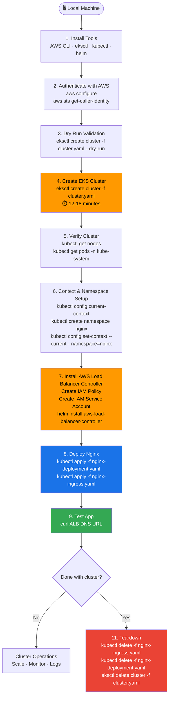

# 🚀 Amazon EKS Cluster Creation & Management Guide

This document contains all the commands and operational procedures required to create, verify, deploy workloads to, and clean up an Amazon EKS cluster using the declarative manifest [`cluster.yaml`](./cluster.yaml).

---

## 🗺️ Overall Flow (Read This First)



---

## 📋 Table of Contents
1. [Prerequisites & Tool Setup](#1-prerequisites--tool-setup)
2. [Verify AWS Authentication](#2-verify-aws-authentication)
3. [Pre-Flight Validation (Dry Run)](#3-pre-flight-validation-dry-run)
4. [Create the EKS Cluster from Manifest](#4-create-the-eks-cluster-from-manifest)
5. [Verify Cluster & Node Status](#5-verify-cluster--node-status)
6. [Context & Namespace Management](#6-context--namespace-management)
7. [AWS Load Balancer Controller Setup (Required for Ingress)](#7-aws-load-balancer-controller-setup-required-for-ingress)
8. [Deploy & Test Nginx Workload](#8-deploy--test-nginx-workload)
9. [Cluster Operations & Scaling](#9-cluster-operations--scaling)
10. [Troubleshooting & Diagnostics](#10-troubleshooting--diagnostics)
11. [Clean Up & Teardown (Stop Billing)](#11-clean-up--teardown-stop-billing)

---

## 1. Prerequisites & Tool Setup

Ensure you have the required CLI tools installed on your system.

### A. AWS CLI
Verify that AWS CLI is installed:
```bash
aws --version
```
If not installed, install via Homebrew (macOS):
```bash
brew install awscli
```

Configure your AWS credentials:
```bash
aws configure
```
*Provide your `AWS Access Key ID`, `AWS Secret Access Key`, default region (e.g. `us-east-1`), and default output format (`json`).*

### B. eksctl
`eksctl` is the official CLI tool from AWS and Weaveworks to create and manage EKS clusters declaratively.

**macOS (via Homebrew):**
```bash
brew tap weaveworks/tap
brew install weaveworks/tap/eksctl
```

**Linux:**
```bash
ARCH=amd64
PLATFORM=$(uname -s)_$ARCH
curl -sLO "https://github.com/eksctl-io/eksctl/releases/latest/download/eksctl_$PLATFORM.tar.gz"
tar -xzf eksctl_$PLATFORM.tar.gz -C /tmp && rm eksctl_$PLATFORM.tar.gz
sudo mv /tmp/eksctl /usr/local/bin
```

Verify installation:
```bash
eksctl version
```

### C. kubectl
Verify `kubectl` is installed:
```bash
kubectl version --client
```
If not installed:
```bash
brew install kubectl
```

---

## 2. Verify AWS Authentication

Confirm your active AWS identity, account ID, and IAM role/user before triggering cluster creation:

```bash
aws sts get-caller-identity
```

Ensure your IAM user or role has permissions to create CloudFormation stacks, VPCs, EC2 instances, and EKS clusters (e.g., `AdministratorAccess` or appropriate least-privilege EKS/VPC/EC2/IAM policies).

---

## 3. Pre-Flight Validation (Dry Run)

Run a dry run against your [`cluster.yaml`](./cluster.yaml) to ensure syntax, schema version, and configuration values are valid before making any AWS API calls:

```bash
eksctl create cluster -f cluster.yaml --dry-run
```

---

## 4. Create the EKS Cluster from Manifest

To provision the complete EKS cluster defined in [`cluster.yaml`](./cluster.yaml), run:

```bash
eksctl create cluster -f cluster.yaml
```

### 💡 What happens behind the scenes during this command?
1. **AWS CloudFormation Stacks**: `eksctl` generates CloudFormation templates to provision:
   - Dedicated VPC with public and private subnets across multiple Availability Zones.
   - Internet Gateway, Route Tables, and a NAT Gateway.
   - IAM Roles, Policies, and Security Groups.
2. **EKS Control Plane**: Provisions managed Kubernetes Master nodes (`API Server`, `etcd`, `controller-manager`) in AWS-managed VPC.
3. **IAM OIDC Provider**: Configures OIDC provider to enable IRSA (IAM Roles for Service Accounts).
4. **Managed Node Group**: Provisions EC2 instances (`t3.medium`) managed under an AWS EC2 Auto Scaling Group.
5. **EKS Add-ons**: Installs and verifies `vpc-cni`, `coredns`, `kube-proxy`, and `aws-ebs-csi-driver`.
6. **Kubeconfig**: Automatically updates your local `~/.kube/config` file to connect to the new cluster.

> ⏱️ **Duration**: Cluster creation typically takes **12 to 18 minutes**.

---

## 5. Verify Cluster & Node Status

Once `eksctl` finishes, verify communication with the Kubernetes API server:

### A. Update Kubeconfig (if running on a different machine or terminal session)
```bash
aws eks update-kubeconfig --region ap-south-1 --name canzova-cluster1
```

**What this command actually does:**
1. Calls the EKS API to fetch your cluster's **endpoint URL** and **certificate authority (CA) data**
2. Writes (or updates) an entry in your local `~/.kube/config` file with:
   - The cluster's API server endpoint
   - The CA certificate to verify the server's identity
   - An auth token command (`aws eks get-token`) that kubectl calls automatically on every request to get a short-lived token
3. Sets this cluster as the **current active context** so all `kubectl` commands immediately target it

> 💡 **When do you need this?**
> - On a **new machine** that has never connected to this cluster
> - In a **new terminal session** if your kubeconfig was never set up
> - After the cluster was **recreated** and the endpoint/CA changed
> - When you want to **switch back** to this cluster after working on another one

> ⚠️ Your AWS CLI must be authenticated (`aws sts get-caller-identity`) with an IAM identity that has `eks:DescribeCluster` permission before running this.

### B. Check Cluster Info
```bash
kubectl cluster-info
```

### C. Verify Worker Nodes
Check that all worker nodes have joined and are in the `Ready` status:
```bash
kubectl get nodes -o wide
```

### D. Verify Core Add-ons & Pods
Verify all system pods in `kube-system` namespace are in `Running` status:
```bash
kubectl get pods -n kube-system
```

---

## 6. Context & Namespace Management

### What is a Context?
A **context** in kubectl is a saved combination of: cluster + user + namespace.
When you run `eksctl create cluster`, it automatically adds a new context to your `~/.kube/config` file.
If you work with multiple clusters, you need to make sure you are pointing at the right one before running any `kubectl` commands.

### A. Check Current Context
Run this whenever you open a new terminal or switch between projects to confirm which cluster kubectl is talking to:
```bash
# Shows the name of the currently active context
kubectl config current-context
```

### B. List All Contexts
Useful when you have multiple clusters (e.g. local minikube + EKS dev + EKS prod):
```bash
# Lists all saved contexts — the active one is marked with *
kubectl config get-contexts
```

### C. Switch Context
Use this when you want to switch from one cluster to another:
```bash
kubectl config use-context <context-name>

# Example: switch to your EKS cluster context
kubectl config use-context arn:aws:eks:ap-south-1:<YOUR_ACCOUNT_ID>:cluster/canzova-cluster1
```
> 💡 After running `eksctl create cluster`, the context name is usually the full ARN of the cluster. Use `get-contexts` to see the exact name.

---

### What is a Namespace?
A **namespace** is a way to logically divide your cluster into isolated sections.
For example: `nginx` namespace for your app, `kube-system` for cluster internals, `monitoring` for Prometheus etc.
By default everything goes into the `default` namespace if you don't specify one.

### D. List All Namespaces
Run this after cluster creation to see what namespaces already exist:
```bash
kubectl get namespaces
```
You will see `default`, `kube-system`, `kube-public` already created by Kubernetes.

### E. Create a Namespace
Create a dedicated namespace for your nginx workload instead of dumping everything in `default`:
```bash
kubectl create namespace nginx
```

### F. Switch to a Namespace (set as default for current context)
Instead of adding `-n nginx` to every command, set it as the default for your current context:
```bash
# All subsequent kubectl commands will target the nginx namespace automatically
kubectl config set-context --current --namespace=nginx
```

### G. Verify the active namespace
```bash
# The NAMESPACE column shows which namespace the current context is using
kubectl config get-contexts
```

### H. Run a one-off command in a specific namespace without switching
```bash
# Use -n flag to target a namespace for a single command only
kubectl get pods -n kube-system
kubectl get pods -n nginx
```

> ⚠️ **When to create a namespace**: Always create one before deploying a real app. Keeping workloads in `default` makes it hard to manage, delete, or isolate resources as your cluster grows.

---

## 7. AWS Load Balancer Controller Setup (Required for Ingress)

> ⚠️ **You MUST complete this section before applying `nginx-ingress.yaml`.**
> Without the AWS Load Balancer Controller, Kubernetes has no idea how to create an ALB on AWS for your Ingress resource.

### Why is this needed?
When you apply an Ingress manifest, Kubernetes looks for an **Ingress Controller** to act on it.
On AWS EKS, that controller is the **AWS Load Balancer Controller** — it watches for Ingress resources and automatically provisions an **Application Load Balancer (ALB)** in your AWS account.

### Step 1: Create IAM Policy for the Controller
The controller needs AWS permissions to create/manage ALBs on your behalf.

> ⚠️ **Always use the latest policy version (v2.11.0+).** Older versions (e.g. v2.7.2) are missing permissions like `elasticloadbalancing:DescribeListenerAttributes` which will cause `AccessDenied` errors and the ALB will never be provisioned.

```bash
# Download the latest IAM policy document from AWS (v2.11.0)
curl -O https://raw.githubusercontent.com/kubernetes-sigs/aws-load-balancer-controller/v2.11.0/docs/install/iam_policy.json

# Create the IAM policy in your AWS account
aws iam create-policy \
  --policy-name AWSLoadBalancerControllerIAMPolicy \
  --policy-document file://iam_policy.json
```

### Step 2: Create IAM Service Account

**What is an IAM Service Account?**
It is a combination of two things glued together:
- A **Kubernetes Service Account** — an identity for a pod running inside your cluster
- An **AWS IAM Role** — permissions to call AWS APIs (create ALB, manage VPC etc.)

Without this, the AWS Load Balancer Controller pod has no way to prove to AWS that it has
permission to create ALBs. You can't hardcode AWS credentials inside a pod — that's a security risk.
Instead, IRSA (IAM Roles for Service Accounts) automatically injects temporary rotating credentials
into the pod via the OIDC provider you enabled in `cluster.yaml` (`withOIDC: true`).

```
Pod (aws-load-balancer-controller)
    ↓ uses
Kubernetes Service Account
    ↓ linked to (via OIDC)
AWS IAM Role
    ↓ has
IAM Policy (permission to create/manage ALBs)
```

The command below creates the Kubernetes Service Account, creates an AWS IAM Role, and attaches the policy you created in Step 1 to that role — all in one shot.
Replace `<YOUR_AWS_ACCOUNT_ID>` with your actual 12-digit AWS account ID.
```bash
eksctl create iamserviceaccount \
  --cluster=canzova-cluster1 \
  --namespace=kube-system \
  --name=aws-load-balancer-controller \
  --attach-policy-arn=arn:aws:iam::<YOUR_AWS_ACCOUNT_ID>:policy/AWSLoadBalancerControllerIAMPolicy \
  --approve \
  --region=ap-south-1
```

### Step 3: Install the Controller via Helm
```bash
# Add the EKS Helm chart repository
helm repo add eks https://aws.github.io/eks-charts
helm repo update

# Install the AWS Load Balancer Controller into kube-system namespace
helm install aws-load-balancer-controller eks/aws-load-balancer-controller \
  -n kube-system \
  --set clusterName=canzova-cluster1 \
  --set serviceAccount.create=false \
  --set serviceAccount.name=aws-load-balancer-controller \
  --set region=ap-south-1 \
  --set vpcId=$(aws eks describe-cluster --name canzova-cluster1 --region ap-south-1 --query 'cluster.resourcesVpcConfig.vpcId' --output text)
```

### Step 4: Verify the Controller is Running
```bash
# Should show 2 pods in Running state
kubectl get pods -n kube-system -l app.kubernetes.io/name=aws-load-balancer-controller
```

---

## 8. Deploy & Test Nginx Workload

At this point your cluster is running and the AWS Load Balancer Controller is installed.
Now deploy the Nginx app, then expose it via Ingress (ALB).

### A. Apply the Deployment and Service
```bash
# This creates the nginx Deployment (pods) + nginx-service (ClusterIP — internal only)
kubectl apply -f nginx-deployment.yaml
```

### B. Verify Pods are Running
```bash
kubectl get pods -l app=nginx-app -o wide
```
Wait until all pods show `Running` status before proceeding.

### C. Apply the Ingress
```bash
# This tells the AWS Load Balancer Controller to create an ALB in your AWS account
kubectl apply -f nginx-ingress.yaml
```

### D. Wait for ALB to be Provisioned
```bash
# Watch until the ADDRESS column is populated with the ALB DNS name (takes ~2 minutes)
kubectl get ingress nginx-ingress -w
```

### E. Test the Application
```bash
# Get the ALB DNS name and curl it
curl http://$(kubectl get ingress nginx-ingress -o jsonpath='{.status.loadBalancer.ingress[0].hostname}')
```
You should see the default Nginx welcome page HTML in the response.

---

## 9. Cluster Operations & Scaling

### A. List Managed Node Groups
```bash
eksctl get nodegroups --cluster canzova-cluster1 --region ap-south-1
```

### B. Scale Worker Node Group Capacity
```bash
eksctl scale nodegroup --cluster canzova-cluster1 --name canzova-cluster1 --nodes 3 --region ap-south-1
```

### C. List Installed EKS Add-ons
```bash
eksctl get addons --cluster canzova-cluster1 --region ap-south-1
```

### D. View Control Plane CloudWatch Logs
```bash
aws logs describe-log-groups --log-group-name-prefix /aws/eks/canzova-cluster1/cluster --region ap-south-1
```

---

## 10. Troubleshooting & Diagnostics

| Symptom | Cause | Resolution Command |
| :--- | :--- | :--- |
| `Unauthorized / AccessDenied` | Missing IAM permissions | Check credentials: `aws sts get-caller-identity` |
| Nodes stuck in `NotReady` | VPC CNI or CoreDNS not running | Run `kubectl describe node <node-name>` and `kubectl get pods -n kube-system` |
| Service `EXTERNAL-IP` `<pending>` | AWS Load Balancer provisioning | Check events: `kubectl describe svc nginx-service` |
| Pod in `CrashLoopBackOff` | Container application error | View container logs: `kubectl logs -l app=nginx-app --tail=50` |
| Ingress `ADDRESS` never populates / `FailedDeployModel` | IAM policy is outdated, missing `DescribeListenerAttributes` | See fix below |

### 🔧 Fix: IAM Policy Outdated (`AccessDenied: DescribeListenerAttributes`)

If you see this in `kubectl describe ingress <name>`:
```
AccessDenied: elasticloadbalancing:DescribeListenerAttributes
```
Your IAM policy was created from an old version. Update it without recreating anything:

```bash
# Step 1: Download the latest policy
curl -O https://raw.githubusercontent.com/kubernetes-sigs/aws-load-balancer-controller/v2.11.0/docs/install/iam_policy.json

# Step 2: Push it as a new default version of the existing policy
aws iam create-policy-version \
  --policy-arn arn:aws:iam::<YOUR_AWS_ACCOUNT_ID>:policy/AWSLoadBalancerControllerIAMPolicy \
  --policy-document file://iam_policy.json \
  --set-as-default

# Step 3: Restart the controller to pick up new permissions
kubectl rollout restart deployment aws-load-balancer-controller -n kube-system

# Step 4: Watch pods come back up
kubectl get pods -n kube-system -l app.kubernetes.io/name=aws-load-balancer-controller -w

# Step 5: Verify ingress ADDRESS is now populated (~2 minutes)
kubectl get ingress nginx-ingress -w
```

---

## 11. Clean Up & Teardown (Stop Billing)

> ⚠️ **IMPORTANT**: AWS charges for running EKS control planes ($0.10/hour), EC2 worker node instances, and active Elastic Load Balancers / NAT Gateways. Always clean up test clusters when you are finished!

### Step 1: Delete Deployed Kubernetes Workloads
Deleting Ingress and Service first guarantees that AWS terminates the associated ALB/NLB before the cluster is deleted:
```bash
kubectl delete -f nginx-ingress.yaml
kubectl delete -f nginx-deployment.yaml
```

### Step 2: Delete the EKS Cluster
Run `eksctl delete cluster` using the manifest file. This cleanly tears down the node groups, CloudFormation stacks, IAM roles, security groups, and VPC:

When you run:
```bash
eksctl delete cluster -f cluster.yaml --wait
```
  The --wait flag tells eksctl to block your terminal and continuously monitor AWS until every single resource is completely deleted:

```bash
eksctl delete cluster -f cluster.yaml --wait
```

### Step 3: Verify Deletion
Verify that the cluster is completely removed:
```bash
aws eks list-clusters --region ap-south-1
```
