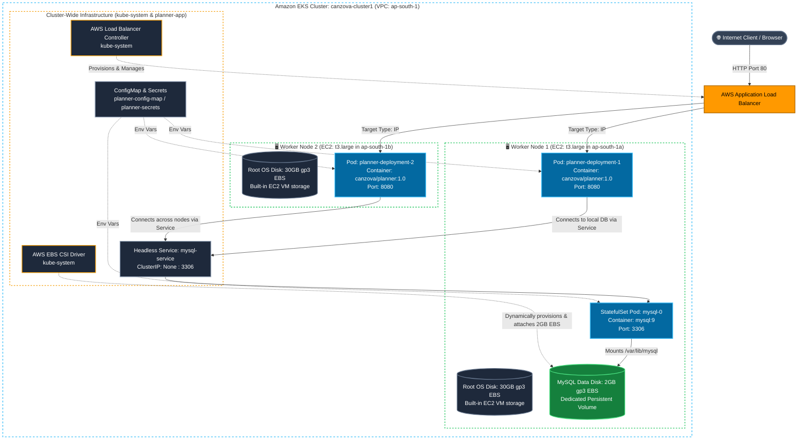

# 🚀 Deploying Spring Boot Backend & MySQL on Amazon EKS: End-to-End Guide

This guide provides a comprehensive, step-by-step walkthrough to deploy a **Spring Boot Backend Application** connected to a **MySQL Database** running inside an **Amazon EKS cluster**, exposed to the internet via the **AWS Load Balancer Controller (ALB)**.

---

## 🏗️ Architecture Overview (Multi-Node EKS Cluster)

This diagram visualizes how workloads, EC2 worker nodes, and EBS volumes are distributed across your cluster:



---

## ⚡ Prerequisites & AWS Dependencies (Configure BEFORE Deploying App)

Before applying your application manifests, your EKS cluster requires **two critical AWS controllers**:
1. **Amazon EBS CSI Driver** — Required for MySQL persistent storage (`PersistentVolumeClaim`).
2. **AWS Load Balancer Controller** — Required to automatically provision an AWS ALB from your Kubernetes `Ingress`.

---

### Dependency 1: Amazon EBS CSI Driver (MANDATORY for MySQL)

#### Why is this required?
* Kubernetes removed legacy in-tree cloud storage plugins.
* In a multi-node EKS cluster, you **cannot use `hostPath`** because data stored on one EC2 node is invisible if the MySQL pod moves to another node.
* MySQL requires persistent storage so your databases and tables survive pod restarts.
* The **Amazon EBS CSI Driver** dynamically creates AWS Elastic Block Store (EBS) `gp3` volumes in your AWS account and attaches them to the worker node hosting your MySQL pod.

#### Step 1.1: Ensure Cluster OIDC Provider is Enabled
IRSA (IAM Roles for Service Accounts) enables Kubernetes pods to call AWS APIs using temporary tokens.
```bash
eksctl utils associate-iam-oidc-provider \
  --cluster canzova-cluster1 \
  --region ap-south-1 \
  --approve
```

#### Step 1.2: Create IAM Service Account for EBS CSI Driver
```bash
eksctl create iamserviceaccount \
  --name ebs-csi-controller-sa \
  --namespace kube-system \
  --cluster canzova-cluster1 \
  --role-name AmazonEKS_EBS_CSI_DriverRole \
  --attach-policy-arn arn:aws:iam::aws:policy/service-role/AmazonEBSCSIDriverPolicy \
  --approve \
  --region ap-south-1
```

#### Step 1.3: Install the AWS EBS CSI Driver Add-on
```bash
ACCOUNT_ID=$(aws sts get-caller-identity --query "Account" --output text)

eksctl create addon \
  --name aws-ebs-csi-driver \
  --cluster canzova-cluster1 \
  --service-account-role-arn arn:aws:iam::${ACCOUNT_ID}:role/AmazonEKS_EBS_CSI_DriverRole \
  --force \
  --region ap-south-1
```

#### Step 1.4: Verify EBS CSI Driver Pods
Confirm the controller pods are running:
```bash
kubectl get pods -n kube-system -l app.kubernetes.io/name=aws-ebs-csi-driver
```
*(You should see `ebs-csi-controller` pods in `Running` state).*

---

### Dependency 2: AWS Load Balancer Controller (MANDATORY for Ingress/ALB)

#### Why is this required?
When you define a Kubernetes `Ingress`, standard Kubernetes does nothing on its own. On AWS, the **AWS Load Balancer Controller** intercepts Ingress objects and automatically provisions an **AWS Application Load Balancer (ALB)**, configures Target Groups, and sets up listener rules.

#### Step 2.1: Create IAM Policy for the Controller
If not already created in your AWS account:
```bash
# Download official policy definition
curl -O https://raw.githubusercontent.com/kubernetes-sigs/aws-load-balancer-controller/v2.11.0/docs/install/iam_policy.json

# Create policy in AWS IAM
aws iam create-policy \
  --policy-name AWSLoadBalancerControllerIAMPolicy \
  --policy-document file://iam_policy.json
```

#### Step 2.2: Create IAM Service Account for Load Balancer Controller
```bash
ACCOUNT_ID=$(aws sts get-caller-identity --query "Account" --output text)

eksctl create iamserviceaccount \
  --cluster=canzova-cluster1 \
  --namespace=kube-system \
  --name=aws-load-balancer-controller \
  --attach-policy-arn=arn:aws:iam::${ACCOUNT_ID}:policy/AWSLoadBalancerControllerIAMPolicy \
  --approve \
  --region=ap-south-1
```

#### Step 2.3: Install AWS Load Balancer Controller via Helm
```bash
# Add EKS Helm repository
helm repo add eks https://aws.github.io/eks-charts
helm repo update

# Install chart
VPC_ID=$(aws eks describe-cluster --name canzova-cluster1 --region ap-south-1 --query 'cluster.resourcesVpcConfig.vpcId' --output text)

helm install aws-load-balancer-controller eks/aws-load-balancer-controller \
  -n kube-system \
  --set clusterName=canzova-cluster1 \
  --set serviceAccount.create=false \
  --set serviceAccount.name=aws-load-balancer-controller \
  --set region=ap-south-1 \
  --set vpcId=${VPC_ID}
```

#### Step 2.4: Verify Controller is Running
```bash
kubectl get pods -n kube-system -l app.kubernetes.io/name=aws-load-balancer-controller
```
*(Should show 2 pods in `Running` state).*

---

### Dependency 3: VPC Subnet Auto-Discovery Tagging (Verify)

The AWS Load Balancer Controller discovers which subnets to place public ALBs in by scanning for the tag `kubernetes.io/role/elb = 1`.

When your cluster is created via `eksctl` with public subnets, these tags are applied automatically. Verify with:
```bash
aws ec2 describe-subnets \
  --filters "Name=vpc-id,Values=${VPC_ID}" \
  --query "Subnets[*].[SubnetId,Tags[?Key=='kubernetes.io/role/elb'].Value]" \
  --region ap-south-1 \
  --output table
```
If missing on public subnets, add them using:
```bash
aws ec2 create-tags \
  --resources <SUBNET_ID_1> <SUBNET_ID_2> \
  --tags Key=kubernetes.io/role/elb,Value=1 \
  --region ap-south-1
```

---

## 📂 Manifest Files Inventory & Exact Creation Order

All manifests are located in this folder (`k8s/EKS/Planner-app/`):

| Order | Manifest File | Kubernetes Kind | Purpose & Why This Order? |
| :---: | :--- | :--- | :--- |
| **1** | [`01-namespace.yaml`](./01-namespace.yaml) | `Namespace` | Creates the logical boundary `planner-app`. Must exist first before applying namespaced resources. |
| **2** | [`02-storageclass.yaml`](./02-storageclass.yaml) | `StorageClass` | Defines AWS EBS `gp3` storage with `WaitForFirstConsumer`. Must exist before volume claims. |
| **3** | [`03-secrets.yaml`](./03-secrets.yaml) | `Secret` | Stores sensitive DB passwords for MySQL and Spring Boot. |
| **4** | [`04-configmap.yaml`](./04-configmap.yaml) | `ConfigMap` | Stores database host, port, db name, and user. Required by Pod env vars. |
| **(5)** | [`05-mysql-pvc.yaml`](./05-mysql-pvc.yaml) | `PersistentVolumeClaim` | *(Optional/Deployment-only)* If using StatefulSet, skip this as `volumeClaimTemplates` handles it automatically. |
| **5** | [`06-mysql-statefulset.yaml`](./06-mysql-statefulset.yaml) | `StatefulSet` & `Service` | Starts the MySQL Pod and Headless Service `mysql-service:3306`. Dynamically provisions EBS volume via `volumeClaimTemplates`. |
| **6** | [`07-planner-deployment.yaml`](./07-planner-deployment.yaml) | `Deployment` & `Service` | Starts Spring Boot app with `initContainer` waiting for MySQL, plus internal Service `planner-service:8080`. |
| **7** | [`08-planner-ingress.yaml`](./08-planner-ingress.yaml) | `Ingress` | Triggers AWS Load Balancer Controller to provision the public ALB routing traffic to Spring Boot. |

---

## 🛠️ Step-by-Step Deployment Execution Guide

Navigate to the directory containing the manifests:
```bash
cd /Users/canzova/IdeaProjects/MicroDevops/k8s/EKS/Planner-app
```

---

### Step 1: Create Namespace
```bash
kubectl apply -f 01-namespace.yaml
```
Set `planner-app` as your active default namespace for kubectl:
```bash
kubectl config set-context --current --namespace=planner-app
```

---

### Step 2: Create StorageClass
```bash
kubectl apply -f 02-storageclass.yaml
```
Verify:
```bash
kubectl get storageclass
```
> 💡 **Why `volumeBindingMode: WaitForFirstConsumer`?**  
> In AWS EKS, worker nodes are distributed across Availability Zones (e.g., `ap-south-1a`, `ap-south-1b`). EBS volumes are zone-locked. `WaitForFirstConsumer` delays creating the AWS EBS volume until Kubernetes schedules the MySQL Pod onto a specific node, guaranteeing the EBS volume is created in the exact same Availability Zone!

---

### Step 3: Create Secrets & ConfigMap
```bash
kubectl apply -f 03-secrets.yaml
kubectl apply -f 04-configmap.yaml
```
Verify:
```bash
kubectl get secrets,configmaps -n planner-app
```

---

### Step 4: Deploy MySQL StatefulSet & Headless Service
```bash
kubectl apply -f 06-mysql-statefulset.yaml
```
> ℹ️ **NOTE**: You do **not** need to manually apply `05-mysql-pvc.yaml` because the StatefulSet automatically provisions its PVC (`mysql-persistent-storage-mysql-0`) dynamically via `volumeClaimTemplates` using your `ebs-gp3-sc` StorageClass!

#### Verification:
1. Watch the MySQL Pod start and transition to `Running`:
   ```bash
   kubectl get pods -n planner-app -l app=mysql-statefulset -w
   ```
2. Check that the PVC is automatically created and `Bound`:
   ```bash
   kubectl get pvc -n planner-app
   ```
3. Check MySQL logs to verify the database engine initialized and is ready for connections:
   ```bash
   kubectl logs -n planner-app -l app=mysql-statefulset --tail=30
   ```
   *(Look for: `[Server] /usr/sbin/mysqld: ready for connections`)*
4. Verify the internal Service is created:
   ```bash
   kubectl get svc -n planner-app mysql-service
   ```

---

### Step 5: Deploy Spring Boot Backend Application
```bash
kubectl apply -f 07-planner-deployment.yaml
```

#### Why Spring Boot will NOT crash:
In `07-planner-deployment.yaml`, we included an `initContainer` (`wait-for-mysql`):
```yaml
initContainers:
  - name: wait-for-mysql
    image: busybox:1.36
    command: ['sh', '-c', 'until nc -z -v -w3 mysql-service 3306; do echo waiting for mysql; sleep 3; done;']
```
This guarantees that Spring Boot will pause until `mysql-service:3306` is accepting connections, preventing `HikariCP` connection failures or `CrashLoopBackOff`.

#### Verification:
1. Watch Pod status:
   ```bash
   kubectl get pods -n planner-app -l app=planner-app-selector-name -w
   ```
   *(Pods will show `Init:0/1`, then `PodInitializing`, then `Running 1/1`).*
2. Inspect Spring Boot application logs:
   ```bash
   kubectl logs -n planner-app -l app=planner-app-selector-name -c planner-container --tail=50 -f
   ```
   *(Look for: `Started PlannerApplication in ... seconds`)*
3. Verify internal Service:
   ```bash
   kubectl get svc -n planner-app planner-service
   ```

---

### Step 6: Expose Backend via AWS Load Balancer Controller (Ingress)
```bash
kubectl apply -f 08-planner-ingress.yaml
```

#### Verification & Testing:
1. Watch the Ingress resource acquire an AWS ALB hostname:
   ```bash
   kubectl get ingress -n planner-app planner-ingress -w
   ```
   *(After 1-3 minutes, the `ADDRESS` column will populate with an AWS ALB DNS name like `k8s-plannera-planneri-xxxx.ap-south-1.elb.amazonaws.com`).*

2. Check AWS Load Balancer Controller logs if debugging is needed:
   ```bash
   kubectl logs -n kube-system -l app.kubernetes.io/name=aws-load-balancer-controller --tail=40
   ```

3. Test your Spring Boot application over the internet:
   ```bash
   ALB_URL=$(kubectl get ingress -n planner-app planner-ingress -o jsonpath='{.status.loadBalancer.ingress[0].hostname}')
   echo "Access your app at: http://${ALB_URL}"

   # Send test request
   curl -I http://${ALB_URL}/
   ```

---

## ⚠️ Important Architectural Considerations for MySQL on EKS

### 1. Replicas MUST be 1
Standard AWS EBS volumes support `ReadWriteOnce` access mode only — an EBS volume can be attached to **only one EC2 instance at a time**.
* Do **NOT** scale `mysql-deployment` to `replicas: 2` or more. Two pods writing to the same raw database files simultaneously will corrupt data.
* If high availability or multi-replica reads are needed in the future, migrate to **Amazon RDS (MySQL)** or AWS Aurora.

### 2. Pod Replacement Strategy: `Recreate`
We specified `strategy: type: Recreate` on the MySQL Deployment.
* Standard `RollingUpdate` would attempt to start the new MySQL pod before terminating the old one.
* Because the EBS volume is locked by the old pod, the new pod would be stuck in `VolumeInUseError`.
* `Recreate` guarantees the old pod terminates and unmounts the volume before the new pod attaches it.

### 3. Reclaim Policy: `Retain`
In `02-storageclass.yaml`, `reclaimPolicy: Retain` is configured:
* If someone accidentally deletes the `mysql-pvc`, the underlying AWS EBS volume is **NOT deleted**. Your database volume remains intact in your AWS account.

---

## 🔍 Troubleshooting Guide

| Issue | Symptom | Root Cause | Solution |
| :--- | :--- | :--- | :--- |
| **PVC stuck in `Pending`** | `kubectl get pvc` shows `Pending` even after MySQL is applied | AWS EBS CSI Driver add-on not installed or missing IAM permissions | Follow **Dependency 1** steps above. Run `kubectl describe pvc mysql-pvc -n planner-app` to see exact driver error. |
| **VolumeZoneMismatch** | Pod stuck in `ContainerCreating` or events show `node affinity mismatch` | StorageClass used `volumeBindingMode: Immediate` instead of `WaitForFirstConsumer` | Ensure `02-storageclass.yaml` has `volumeBindingMode: WaitForFirstConsumer`. |
| **Spring Boot in `CrashLoopBackOff`** | `CommunicationsLinkException` / `Access denied for user` | Mismatch between `planner-config-map` and `planner-secret` or MySQL not initialized | Verify passwords in `03-secrets.yaml` match between Spring Boot and MySQL. Check `kubectl logs -l app=mysql-app`. |
| **Ingress `ADDRESS` is blank** | `kubectl get ingress` shows empty `ADDRESS` after 5 minutes | AWS Load Balancer Controller not running or public subnets lack `kubernetes.io/role/elb: 1` tag | Check controller logs: `kubectl logs -n kube-system -l app.kubernetes.io/name=aws-load-balancer-controller`. Verify subnet tags. |
| **ALB returns `502 Bad Gateway`** | ALB Target Group health checks failing | Spring Boot health check path does not match `alb.ingress.kubernetes.io/healthcheck-path` | Change health check path in `08-planner-ingress.yaml` to `/` if Spring Boot Actuator is not included, then re-apply. |

---

## 🧹 Teardown & Clean Up (Stop AWS Billing)

When you are done testing and want to avoid ongoing AWS charges (ALB and EBS volumes accrue hourly costs), delete resources in reverse order:

```bash
# 1. Delete Ingress FIRST (instructs AWS Load Balancer Controller to delete the ALB)
kubectl delete -f 08-planner-ingress.yaml

# 2. Delete Spring Boot Application
kubectl delete -f 07-planner-deployment.yaml

# 3. Delete MySQL Workload
kubectl delete -f 06-mysql-deployment.yaml

# 4. Delete PVC & StorageClass
kubectl delete -f 05-mysql-pvc.yaml
kubectl delete -f 04-configmap.yaml
kubectl delete -f 03-secrets.yaml
kubectl delete -f 02-storageclass.yaml

# 5. Delete Namespace
kubectl delete -f 01-namespace.yaml

# 6. Check AWS Console for any retained EBS volumes if you want to delete them completely
aws ec2 describe-volumes --filters Name=tag:kubernetes.io/created-for/pvc/name,Values=mysql-pvc --region ap-south-1
```
