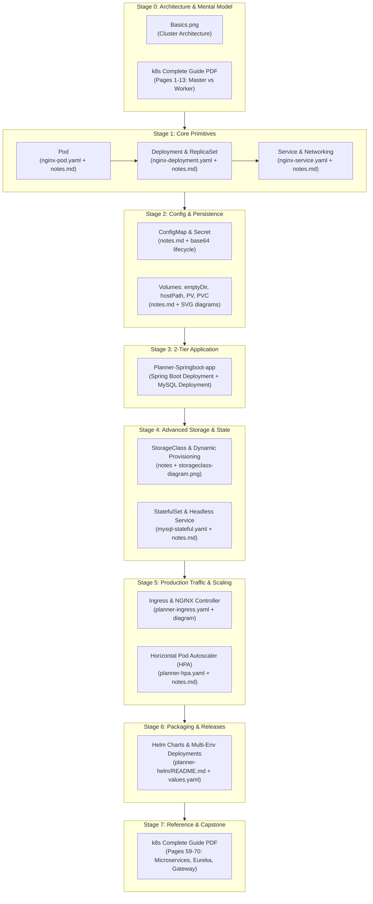

# 🗺️ Kubernetes (K8s) Master Learning Path & Roadmap

Welcome to your complete hands-on Kubernetes curriculum! This repository contains notes, diagrams, manifests, and full multi-tier application deployments built around real-world Spring Boot and MySQL microservices.

This roadmap details the exact pedagogical order you should follow, mapping every concept to its corresponding `notes.md`, YAML manifest, visual diagram, and section in the master PDF reference ([`k8s_complete_guide_lyst1785594969577.pdf`](file:///Users/canzova/IdeaProjects/MicroDevops/k8s/k8s_complete_guide_lyst1785594969577.pdf)).

---

## 🧭 Visual Roadmap Overview



---

## 📚 Step-by-Step Learning Order

### Phase 1: Foundations & Core Workloads (Days 1–3)

#### 1. Cluster Architecture & High-Level Mental Model
Before executing commands, build an accurate mental model of how a Kubernetes cluster operates.
* **Primary Resource**: [`Basics.png`](file:///Users/canzova/IdeaProjects/MicroDevops/k8s/Basics.png)
  * Examine the division between the **Control Plane / Master Node** (`kube-apiserver`, `kube-scheduler`, `kube-controller-manager`, `etcd`) and **Worker Nodes** (`kubelet`, `kube-proxy`, container runtime).
  * Understand the relationship: Cluster $\rightarrow$ Node $\rightarrow$ Pod $\rightarrow$ Container.
* **PDF Reference**: [`k8s_complete_guide_lyst1785594969577.pdf`](file:///Users/canzova/IdeaProjects/MicroDevops/k8s/k8s_complete_guide_lyst1785594969577.pdf) (Pages 1–13: "Kubernetes Architecture & Core Concepts").
* **Key Concept to Master**: `etcd` is the source of truth, API server is the gateway, Scheduler assigns nodes, and Kubelet runs containers.

#### 2. Pods — The Smallest Deployable Unit
Learn how to define, validate, deploy, and debug a single Pod.
* **Primary Notes**: [`Pod/notes.md`](file:///Users/canzova/IdeaProjects/MicroDevops/k8s/Pod/notes.md)
* **Manifest to Practice**: [`Pod/nginx-pod.yaml`](file:///Users/canzova/IdeaProjects/MicroDevops/k8s/Pod/nginx-pod.yaml)
* **Key Topics**:
  * The essential workflow: `cluster-info` $\rightarrow$ `create namespace` $\rightarrow$ `config set-context`.
  * Pre-flight validation with dry-run: `kubectl apply --dry-run=client -f nginx-pod.yaml`.
  * Debugging toolkit: `kubectl describe pod`, `kubectl logs`, `kubectl exec -it -- /bin/sh`.
  * Port forwarding: `kubectl port-forward pod/nginx-pod 8080:80`.
  * Pod Resource Governance: `resources.requests` (scheduling floor) vs `resources.limits` (runtime ceiling, throttling vs OOMKilled).

#### 3. Deployments & ReplicaSets — Self-Healing & Rollouts
Understand why standalone Pods are never created in production and how Deployments provide self-healing, scaling, and rolling updates.
* **Primary Notes**: [`Deployment/notes.md`](file:///Users/canzova/IdeaProjects/MicroDevops/k8s/Deployment/notes.md)
* **Manifest to Practice**: [`Deployment/nginx-deployment.yaml`](file:///Users/canzova/IdeaProjects/MicroDevops/k8s/Deployment/nginx-deployment.yaml)
* **Key Topics**:
  * Hierarchy: `Deployment` manages `ReplicaSet`, and `ReplicaSet` manages `Pods`.
  * Pod Templates and label selectors: `matchLabels` must match `template.metadata.labels`.
  * Testing Self-Healing: Deleting a pod and watching ReplicaSet automatically recreate it.
  * Rollouts and Rollbacks: `kubectl set image`, `kubectl rollout status`, `kubectl rollout undo`.
  * Scaling imperatively and declaratively: `kubectl scale deployment --replicas=5`.

#### 4. Services & Internal Networking
Solve the ephemeral IP problem by providing stable network endpoints and load balancing.
* **Primary Notes**: [`Service/notes.md`](file:///Users/canzova/IdeaProjects/MicroDevops/k8s/Service/notes.md)
* **Manifest to Practice**: [`Service/nginx-service.yaml`](file:///Users/canzova/IdeaProjects/MicroDevops/k8s/Service/nginx-service.yaml)
* **Key Topics**:
  * The four Service types:
    1. **`ClusterIP`** (default, internal communication).
    2. **`NodePort`** (ports 30000–32767 on node IPs).
    3. **`LoadBalancer`** (cloud-provisioned or Docker Desktop `localhost` mapping).
    4. **`ExternalName`** (DNS CNAME redirect without proxying).
  * Port terminology demystified: `port` (service) vs `targetPort` (pod container) vs `nodePort` (node external port).
  * Service discovery via DNS (`service-name.namespace.svc.cluster.local`) and inspection via `kubectl get endpoints`.
* **PDF Reference**: [`k8s_complete_guide_lyst1785594969577.pdf`](file:///Users/canzova/IdeaProjects/MicroDevops/k8s/k8s_complete_guide_lyst1785594969577.pdf) (Pages 14–21).

---

### Phase 2: Configuration & Persistence (Days 4–6)

#### 5. Externalized Configuration — ConfigMap & Secret
Decouple application configuration and credentials from your container images.
* **Primary Notes**: [`Planner-Springboot-app/ConfigMap-&-Secret/notes.md`](file:///Users/canzova/IdeaProjects/MicroDevops/k8s/Planner-Springboot-app/ConfigMap-&-Secret/notes.md)
* **Manifests**:
  * [`Planner-Springboot-app/ConfigMap-&-Secret/planner-configMap.yaml`](file:///Users/canzova/IdeaProjects/MicroDevops/k8s/Planner-Springboot-app/ConfigMap-&-Secret/planner-configMap.yaml)
  * [`Planner-Springboot-app/ConfigMap-&-Secret/planner-Secret.yaml`](file:///Users/canzova/IdeaProjects/MicroDevops/k8s/Planner-Springboot-app/ConfigMap-&-Secret/planner-Secret.yaml)
* **Key Topics**:
  * 3 injection methods: Environment variables (`envFrom` / `configMapKeyRef`), CLI arguments, mounted configuration files.
  * ConfigMap vs Secret: plain text vs base64 encoding (note: base64 is not encryption).
  * **The Secret lifecycle deep dive**: `stringData` (human-readable) converted to base64 by `kube-apiserver` upon creation, decoded back to plain text automatically by `kubelet` inside the container.

#### 6. Storage Fundamentals — emptyDir, hostPath, PV & PVC
Master state persistence, container filesystem lifecycles, and volume binding.
* **Primary Notes**: [`Planner-Springboot-app/Volume/notes.md`](file:///Users/canzova/IdeaProjects/MicroDevops/k8s/Planner-Springboot-app/Volume/notes.md)
* **Visual Diagrams**:
  * [`Planner-Springboot-app/Volume/volume-locations-diagram.svg`](file:///Users/canzova/IdeaProjects/MicroDevops/k8s/Planner-Springboot-app/Volume/volume-locations-diagram.svg) (See where `emptyDir`, `hostPath`, `PVC`, and `PV` physically reside).
  * [`Planner-Springboot-app/Volume/access-modes-diagram.svg`](file:///Users/canzova/IdeaProjects/MicroDevops/k8s/Planner-Springboot-app/Volume/access-modes-diagram.svg) (Visual comparison of `ReadWriteOnce`, `ReadWriteOncePod`, `ReadOnlyMany`, `ReadWriteMany`).
  * [`Stateful-Planner-App/Volume/abstract class vs interface.png`](file:///Users/canzova/IdeaProjects/MicroDevops/k8s/Stateful-Planner-App/Volume/abstract%20class%20vs%20interface.png) (Helpful OOP analogy: PV is the concrete implementation, PVC is the interface contract).
* **Manifests to Practice**:
  * [`Planner-Springboot-app/Volume/pv.yaml`](file:///Users/canzova/IdeaProjects/MicroDevops/k8s/Planner-Springboot-app/Volume/pv.yaml)
  * [`Planner-Springboot-app/Volume/pvc.yaml`](file:///Users/canzova/IdeaProjects/MicroDevops/k8s/Planner-Springboot-app/Volume/pvc.yaml)
* **Key Topics**:
  * Why `emptyDir` dies with the pod, and why `hostPath` fails in multi-node clusters.
  * Separation of concerns: Admin provisions `PersistentVolume` (cluster-level); Developer claims storage via `PersistentVolumeClaim` (namespace-level).
  * Reclaim policies: `Retain` (safe for databases) vs `Delete` (cloud default).
  * Disambiguation of `volumes[].name` (internal pod link) vs `persistentVolumeClaim.claimName` (actual PVC object name).
* **PDF Reference**: [`k8s_complete_guide_lyst1785594969577.pdf`](file:///Users/canzova/IdeaProjects/MicroDevops/k8s/k8s_complete_guide_lyst1785594969577.pdf) (Pages 22–40: Volumes, PVs, PVCs, and Hotel Room booking analogy).

---

### Phase 3: Building Real Applications & Dynamic Storage (Days 7–9)

#### 7. Deploying the 2-Tier Planner Spring Boot & MySQL App
Put Pods, Deployments, Services, ConfigMaps, Secrets, and PVCs together into an integrated application.
* **Directory**: [`Planner-Springboot-app/`](file:///Users/canzova/IdeaProjects/MicroDevops/k8s/Planner-Springboot-app)
* **Manifests**:
  * [`Planner-Springboot-app/mysql-deployment.yaml`](file:///Users/canzova/IdeaProjects/MicroDevops/k8s/Planner-Springboot-app/mysql-deployment.yaml) (Runs MySQL 8.4 with mounted `/var/lib/mysql` PVC and ClusterIP Service on 3306).
  * [`Planner-Springboot-app/planner-deployment.yaml`](file:///Users/canzova/IdeaProjects/MicroDevops/k8s/Planner-Springboot-app/planner-deployment.yaml) (Runs the Spring Boot REST API wired to MySQL).
* **PDF Reference**: [`k8s_complete_guide_lyst1785594969577.pdf`](file:///Users/canzova/IdeaProjects/MicroDevops/k8s/k8s_complete_guide_lyst1785594969577.pdf) (Pages 50–58: "Deploying Spring Boot Application to Kubernetes").
* **Key Takeaways**:
  * How the Spring Boot container connects to MySQL via `http://mysql-service:3306` using K8s internal DNS.
  * Why running a database in a standard Deployment is fine for learning with `replicas: 1`, but presents risks for high availability and scaling.

#### 8. StorageClass & Dynamic Volume Provisioning
Eliminate manual PV creation by automating volume provisioning on demand.
* **Primary Notes**: [`Storage Class/notes`](file:///Users/canzova/IdeaProjects/MicroDevops/k8s/Storage%20Class/notes)
* **Visual Diagram**: [`Storage Class/storageclass-diagram.png`](file:///Users/canzova/IdeaProjects/MicroDevops/k8s/Storage%20Class/storageclass-diagram.png) (Dynamic provisioning flow from Spring Boot $\rightarrow$ MySQL $\rightarrow$ PVC $\rightarrow$ StorageClass $\rightarrow$ CSI Driver $\rightarrow$ Cloud Disk).
* **Manifest to Practice**: [`Storage Class/planner-storageclass.yaml`](file:///Users/canzova/IdeaProjects/MicroDevops/k8s/Storage%20Class/planner-storageclass.yaml)
* **Key Topics**:
  * Static provisioning (manual PV YAML) vs Dynamic provisioning (CSI plugin provisions PV automatically).
  * Key fields: `provisioner`, `reclaimPolicy`, `volumeBindingMode: WaitForFirstConsumer`, `allowVolumeExpansion`.
* **PDF Reference**: [`k8s_complete_guide_lyst1785594969577.pdf`](file:///Users/canzova/IdeaProjects/MicroDevops/k8s/k8s_complete_guide_lyst1785594969577.pdf) (Pages 32–35, 47–49).

---

### Phase 4: Production Architecture, StatefulSets & Ingress (Days 10–12)

#### 9. StatefulSets vs Deployments — Running True Stateful Workloads
Upgrade the database layer from a stateless Deployment to a production-grade StatefulSet.
* **Primary Notes**: [`Stateful-Planner-App/StatefulSet/notes.md`](file:///Users/canzova/IdeaProjects/MicroDevops/k8s/Stateful-Planner-App/StatefulSet/notes.md)
* **Manifest to Practice**: [`Stateful-Planner-App/StatefulSet/mysql-stateful.yaml`](file:///Users/canzova/IdeaProjects/MicroDevops/k8s/Stateful-Planner-App/StatefulSet/mysql-stateful.yaml)
* **Key Topics**:
  * Cashiers (Deployments) vs Doctors (StatefulSets): interchangeable vs sticky identity.
  * The 3 Guarantees:
    1. **Predictable names**: `mysql-stateful-0`, `mysql-stateful-1`, `mysql-stateful-2`.
    2. **Dedicated storage per replica**: `volumeClaimTemplates` creates individual PVCs.
    3. **Ordered startup and teardown**: $0 \rightarrow 1 \rightarrow 2$ scaling up; reverse scaling down.
  * **Headless Service**: Why `clusterIP: None` is required for per-pod DNS routing (`mysql-stateful-0.mysql-service`).
  * Primary-Replica database replication realities: Why K8s manages identity while operators (e.g. CloudNativePG, Percona) manage replication failover.

#### 10. Ingress & Ingress Controller — Centralized Traffic Routing
Expose the application through a single reverse proxy entrypoint with path-based and host-based routing.
* **Primary Notes**: [`Stateful-Planner-App/Ingress/notes.md`](file:///Users/canzova/IdeaProjects/MicroDevops/k8s/Stateful-Planner-App/Ingress/notes.md)
* **Visual Diagram**: [`Stateful-Planner-App/Ingress/ingress-routing-diagram.png`](file:///Users/canzova/IdeaProjects/MicroDevops/k8s/Stateful-Planner-App/Ingress/ingress-routing-diagram.png) (Traffic routing: Internet $\rightarrow$ Load Balancer $\rightarrow$ Ingress Controller $\rightarrow$ Services $\rightarrow$ Pods).
* **Manifest to Practice**: [`Stateful-Planner-App/Ingress/planner-ingress.yaml`](file:///Users/canzova/IdeaProjects/MicroDevops/k8s/Stateful-Planner-App/Ingress/planner-ingress.yaml)
* **Key Topics**:
  * Ingress Resource (declarative rules) vs Ingress Controller (the actual NGINX/ALB proxy engine).
  * Why Ingress is superior to multiple `LoadBalancer` services (cost savings, TLS termination, path routing).
  * Setting up local host routing on macOS: editing `/etc/hosts` for `blog.local` $\rightarrow$ `127.0.0.1`.

---

### Phase 5: Autoscaling & Helm Packaging (Days 13–15)

#### 11. Autoscaling — Horizontal Pod Autoscaler (HPA)
Automate scaling based on real-time traffic and CPU/memory utilization.
* **Primary Notes**: [`Planner-Springboot-app/hpa/notes.md`](file:///Users/canzova/IdeaProjects/MicroDevops/k8s/Planner-Springboot-app/hpa/notes.md)
* **Manifests**:
  * [`Planner-Springboot-app/hpa/planner-hpa.yaml`](file:///Users/canzova/IdeaProjects/MicroDevops/k8s/Planner-Springboot-app/hpa/planner-hpa.yaml)
  * [`Stateful-Planner-App/hpa/planner-hpa.yaml`](file:///Users/canzova/IdeaProjects/MicroDevops/k8s/Stateful-Planner-App/hpa/planner-hpa.yaml)
* **Key Topics**:
  * The Distinction: **HPA** (scales pods) vs **Cluster Autoscaler** (scales VMs/nodes) vs **VPA** (resizes pod specs).
  * Mathematical formula behind target utilization:
    $$\text{desiredReplicas} = \left\lceil \text{currentReplicas} \times \left( \frac{\text{currentMetricValue}}{\text{desiredMetricValue}} \right) \right\rceil$$
  * Metric Server installation & `--kubelet-insecure-tls` patch on Docker Desktop.
  * Fine-tuning scale-up vs scale-down policies (`stabilizationWindowSeconds` to prevent flapping).
* **PDF Reference**: [`k8s_complete_guide_lyst1785594969577.pdf`](file:///Users/canzova/IdeaProjects/MicroDevops/k8s/k8s_complete_guide_lyst1785594969577.pdf) (Pages 71–82: HPA metrics and timelines).

#### 12. Helm Package Management — Production Templating & Releases
Package the entire multi-manifest architecture into a reusable, parameterizable Helm Chart.
* **Primary Guide**: [`planner-helm/README.md`](file:///Users/canzova/IdeaProjects/MicroDevops/k8s/planner-helm/README.md)
* **Visual Diagram**: [`planner-helm/helm-chart-rendering-flow.svg`](file:///Users/canzova/IdeaProjects/MicroDevops/k8s/planner-helm/helm-chart-rendering-flow.svg) (How templates + `values.yaml` render into cluster releases).
* **Chart Codebase**:
  * Metadata & configuration: [`planner-helm/Chart.yaml`](file:///Users/canzova/IdeaProjects/MicroDevops/k8s/planner-helm/Chart.yaml), [`planner-helm/values.yaml`](file:///Users/canzova/IdeaProjects/MicroDevops/k8s/planner-helm/values.yaml)
  * Chart templates: [`planner-helm/templates/`](file:///Users/canzova/IdeaProjects/MicroDevops/k8s/planner-helm/templates) (`planner-deployment.yaml`, `mysql-statefulset.yaml`, `service.yaml`, `ingress.yaml`, `hpa.yaml`, `configmap.yaml`, `secret.yaml`, `pv.yaml`, `pvc.yaml`, `_helpers.tpl`).
* **Key Topics**:
  * Package manager concepts: Charts, Releases, Repositories.
  * Go templating syntax: `{{ .Values.replicaCount }}`, helpers, and pipelines.
  * Managing multiple environments: `values-dev.yaml` (1 replica) vs `values-prod.yaml` (5 replicas, zero-downtime rolling update strategy).
  * Release lifecycles: `helm lint`, `helm template`, `helm install`, `helm upgrade`, `helm rollback`, and `helm uninstall`.
* **PDF Reference**: [`k8s_complete_guide_lyst1785594969577.pdf`](file:///Users/canzova/IdeaProjects/MicroDevops/k8s/k8s_complete_guide_lyst1785594969577.pdf) (Pages 83–93: "Helm Complete Guide").

---

### Phase 6: Advanced Capstone & Microservices (Reference)

#### 13. Spring Cloud Microservices on Kubernetes
Explore how distributed microservice architectures (Spring Cloud Eureka, Spring Cloud Config Server, API Gateway) transition into Kubernetes.
* **Master Resource**: [`k8s_complete_guide_lyst1785594969577.pdf`](file:///Users/canzova/IdeaProjects/MicroDevops/k8s/k8s_complete_guide_lyst1785594969577.pdf) (Pages 59–70: "Quiz App Microservices Architecture on K8s").
* **Key Topics**:
  * Deploying Config Server, Service Registry (Eureka), and API Gateway manifests.
  * Actuator readiness probes: `/actuator/health/readiness`.
  * When to use Spring Cloud features vs native Kubernetes capabilities (K8s DNS replaces Eureka; K8s ConfigMap replaces Config Server).

---

## 🗂️ Complete Directory & Resource Inventory

| # | Folder / Concept | Core Note File | Key Visual Assets | YAML Manifests | Companion PDF Guide Pages |
|---|---|---|---|---|---|
| **0** | **Cluster Architecture** | — | [`Basics.png`](file:///Users/canzova/IdeaProjects/MicroDevops/k8s/Basics.png) | — | Pages 1–13 |
| **1** | **Pod** | [`Pod/notes.md`](file:///Users/canzova/IdeaProjects/MicroDevops/k8s/Pod/notes.md) | In notes (ASCII workflows) | [`Pod/nginx-pod.yaml`](file:///Users/canzova/IdeaProjects/MicroDevops/k8s/Pod/nginx-pod.yaml) | Pages 10–13 |
| **2** | **Deployment** | [`Deployment/notes.md`](file:///Users/canzova/IdeaProjects/MicroDevops/k8s/Deployment/notes.md) | In notes (ReplicaSet trees) | [`Deployment/nginx-deployment.yaml`](file:///Users/canzova/IdeaProjects/MicroDevops/k8s/Deployment/nginx-deployment.yaml) | Pages 10–13, 44–46 |
| **3** | **Service** | [`Service/notes.md`](file:///Users/canzova/IdeaProjects/MicroDevops/k8s/Service/notes.md) | In notes (Request flow) | [`Service/nginx-service.yaml`](file:///Users/canzova/IdeaProjects/MicroDevops/k8s/Service/nginx-service.yaml) | Pages 14–21 |
| **4** | **ConfigMap & Secret** | [`Planner-Springboot-app/ConfigMap-&-Secret/notes.md`](file:///Users/canzova/IdeaProjects/MicroDevops/k8s/Planner-Springboot-app/ConfigMap-&-Secret/notes.md) | In notes (Injection diagram) | `planner-configMap.yaml`, `planner-Secret.yaml` | Pages 29–30, 42 |
| **5** | **Volumes (PV & PVC)** | [`Planner-Springboot-app/Volume/notes.md`](file:///Users/canzova/IdeaProjects/MicroDevops/k8s/Planner-Springboot-app/Volume/notes.md) | [`volume-locations-diagram.svg`](file:///Users/canzova/IdeaProjects/MicroDevops/k8s/Planner-Springboot-app/Volume/volume-locations-diagram.svg), [`access-modes-diagram.svg`](file:///Users/canzova/IdeaProjects/MicroDevops/k8s/Planner-Springboot-app/Volume/access-modes-diagram.svg) | `pv.yaml`, `pvc.yaml` | Pages 22–31, 36–40 |
| **6** | **2-Tier App (Stateless MySQL)** | Cross-referenced | — | [`mysql-deployment.yaml`](file:///Users/canzova/IdeaProjects/MicroDevops/k8s/Planner-Springboot-app/mysql-deployment.yaml), [`planner-deployment.yaml`](file:///Users/canzova/IdeaProjects/MicroDevops/k8s/Planner-Springboot-app/planner-deployment.yaml) | Pages 50–58 |
| **7** | **StorageClass** | [`Storage Class/notes`](file:///Users/canzova/IdeaProjects/MicroDevops/k8s/Storage%20Class/notes) | [`storageclass-diagram.png`](file:///Users/canzova/IdeaProjects/MicroDevops/k8s/Storage%20Class/storageclass-diagram.png) | [`planner-storageclass.yaml`](file:///Users/canzova/IdeaProjects/MicroDevops/k8s/Storage%20Class/planner-storageclass.yaml) | Pages 32–35, 47–49 |
| **8** | **StatefulSet** | [`Stateful-Planner-App/StatefulSet/notes.md`](file:///Users/canzova/IdeaProjects/MicroDevops/k8s/Stateful-Planner-App/StatefulSet/notes.md) | In notes (Doctor vs Cashier) | [`mysql-stateful.yaml`](file:///Users/canzova/IdeaProjects/MicroDevops/k8s/Stateful-Planner-App/StatefulSet/mysql-stateful.yaml) | Pages 41, 49 |
| **9** | **Ingress** | [`Stateful-Planner-App/Ingress/notes.md`](file:///Users/canzova/IdeaProjects/MicroDevops/k8s/Stateful-Planner-App/Ingress/notes.md) | [`ingress-routing-diagram.png`](file:///Users/canzova/IdeaProjects/MicroDevops/k8s/Stateful-Planner-App/Ingress/ingress-routing-diagram.png) | [`planner-ingress.yaml`](file:///Users/canzova/IdeaProjects/MicroDevops/k8s/Stateful-Planner-App/Ingress/planner-ingress.yaml) | Pages 19, 84, 87 |
| **10** | **HPA** | [`Planner-Springboot-app/hpa/notes.md`](file:///Users/canzova/IdeaProjects/MicroDevops/k8s/Planner-Springboot-app/hpa/notes.md) | In notes (Control loop) | `planner-hpa.yaml` | Pages 71–82 |
| **11** | **Helm** | [`planner-helm/README.md`](file:///Users/canzova/IdeaProjects/MicroDevops/k8s/planner-helm/README.md) | [`helm-chart-rendering-flow.svg`](file:///Users/canzova/IdeaProjects/MicroDevops/k8s/planner-helm/helm-chart-rendering-flow.svg) | Full Helm chart in [`planner-helm/`](file:///Users/canzova/IdeaProjects/MicroDevops/k8s/planner-helm) | Pages 83–93 |
| **12** | **Full PDF Guide** | Master manual | Multiple in-book schematics | All manifest examples included | Complete 93 pages |

---

## 🛠️ Recommended Local Lab Setup

To practice everything in this repository without cloud bills, use **Docker Desktop with Kubernetes**:

1. **Verify cluster**:
   ```bash
   kubectl cluster-info
   kubectl get nodes
   ```
2. **Setup Metrics Server** (required for HPA):
   ```bash
   kubectl apply -f https://github.com/kubernetes-sigs/metrics-server/releases/latest/download/components.yaml
   kubectl patch deployment metrics-server -n kube-system --type='json' \
     -p='[{"op":"add","path":"/spec/template/spec/containers/0/args/-","value":"--kubelet-insecure-tls"}]'
   ```
3. **Install NGINX Ingress Controller** (required for Ingress):
   ```bash
   kubectl apply -f https://raw.githubusercontent.com/kubernetes/ingress-nginx/controller-v1.11.2/deploy/static/provider/cloud/deploy.yaml
   ```
4. **Configure Local Host Routing**:
   ```bash
   echo "127.0.0.1  blog.local" | sudo tee -a /etc/hosts
   ```
