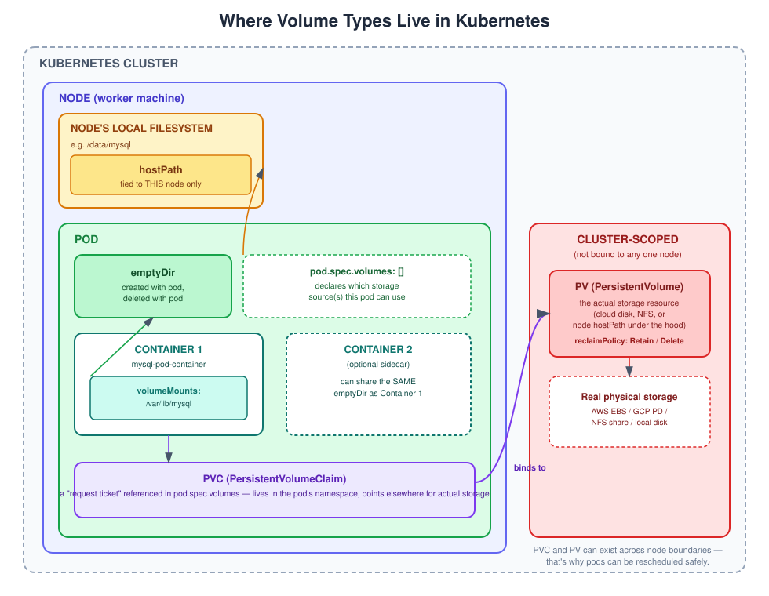
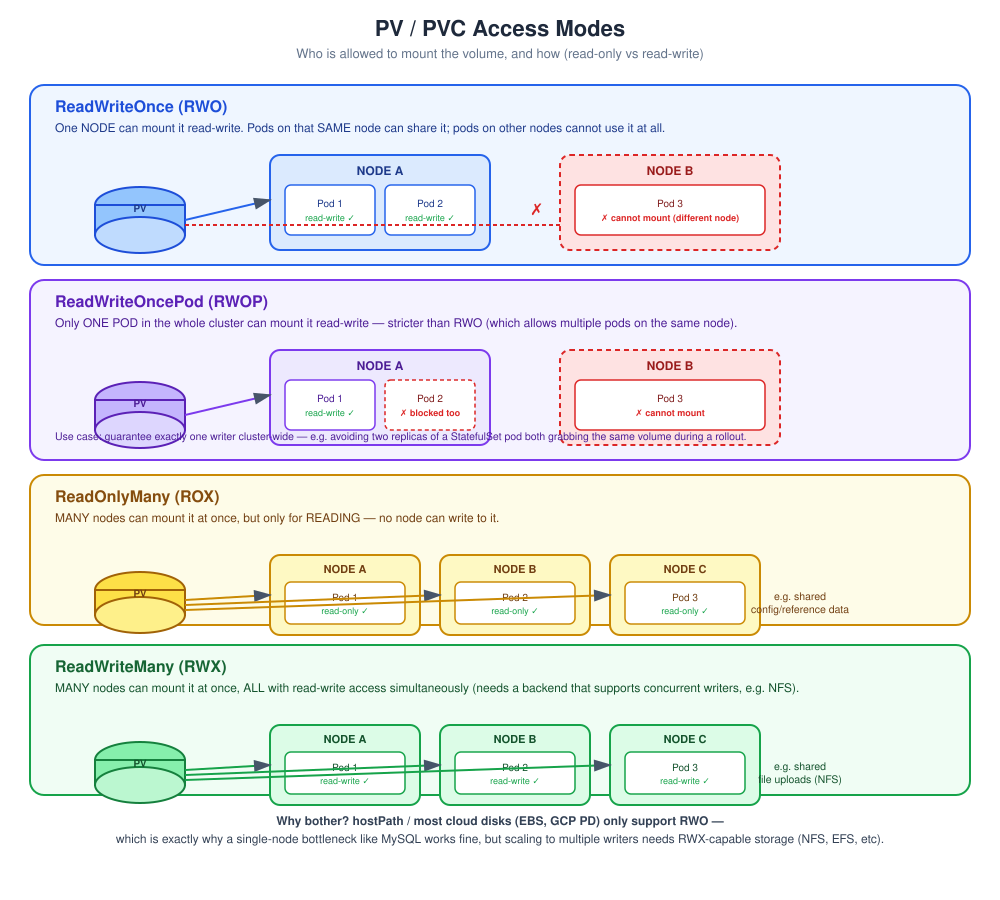

# Kubernetes Volumes: emptyDir, hostPath, PV & PVC

Volumes in Kubernetes work differently from Docker, so let's build this up step by step, starting with the concept and ending with your actual MySQL deployment fixed up.

## The core idea

In Kubernetes, a volume is defined in **two parts**:

1. **`volumes:`** (at the Pod/spec level) — *where the storage actually comes from*
2. **`volumeMounts:`** (inside each container) — *where that storage appears inside the container's filesystem*

You always need both. Think of `volumes` as "here's a disk I have," and `volumeMounts` as "plug that disk into this folder inside my container."

```yaml
spec:
  containers:
    - name: mysql-pod-container
      volumeMounts:
        - name: mysql-storage        # must match the volume name below
          mountPath: /var/lib/mysql  # where MySQL stores its data
  volumes:
    - name: mysql-storage
      <type of volume goes here>
```

Now let's go through each type.

Here's a visual first, showing where each of these actually lives — inside a container, inside a pod, on the node's disk, or at the cluster level:



**Quick read of the diagram:**
- **`emptyDir`** lives *inside the pod*, outside any single container — it's created when the pod starts and can be shared between multiple containers in that pod. It disappears when the pod does.
- **`hostPath`** lives on the *node's own filesystem*, outside the pod entirely. The pod just mounts a folder from whatever node it happens to be running on — so it's tied to that specific machine.
- **`PVC`** sits *inside the pod's spec* (in its namespace) but doesn't hold any data itself — it's just a claim/request that gets referenced by `pod.spec.volumes`.
- **`PV`** lives at the *cluster level*, completely independent of any node or pod — it points to the real underlying storage (a cloud disk, NFS share, or even a hostPath under the hood). The PVC binds to it from wherever the pod happens to be scheduled.

This is exactly why PV + PVC survives pod rescheduling and hostPath/emptyDir don't — PV/PVC live above the node, while hostPath and emptyDir live below or inside it.

---

## 1. `emptyDir`

**What it is:** A temporary, empty folder created *when the pod starts*, and **deleted when the pod dies**. It's shared between containers in the same pod, but not persistent across restarts.

**When to use it:** Scratch space, caching, temp files — never for a database you care about.

```yaml
volumes:
  - name: temp-storage
    emptyDir: {}
```

❌ **Don't use this for MySQL** — if the pod restarts (which happens often — crashes, updates, node moves), your entire database disappears.

---

## 2. `hostPath`

**What it is:** Mounts a folder from the **worker node's actual filesystem** into the pod. E.g., `/data/mysql` on the physical/VM node.

```yaml
volumes:
  - name: mysql-storage
    hostPath:
      path: /data/mysql
      type: DirectoryOrCreate
```

**When to use it:** Local testing on a single-node cluster (like Minikube or Docker Desktop's Kubernetes).

**Why it's risky in real clusters:** If your pod gets rescheduled to a *different* node (which Kubernetes does automatically), the data isn't there anymore — it's tied to one specific machine. Also multiple pods writing to the same host path can conflict. It's basically Kubernetes' version of a Docker bind mount, with the same node-locality problem magnified by clustering.

Good for learning/local dev, bad for anything resembling production.

---

## 3. PV (PersistentVolume) and PVC (PersistentVolumeClaim)

This is the real, production-grade way to do storage in Kubernetes — and it's the one you should use for MySQL.

**The mental model:**
- **PV (PersistentVolume)** = the actual storage resource that exists in your cluster (could be a cloud disk like AWS EBS/GCP PD, an NFS share, or even a hostPath under the hood). Think of it as "a disk that exists, administered separately from your app."
- **PVC (PersistentVolumeClaim)** = a *request* for storage made by your pod. Think of it as "I need 1Gi of storage, please give me a matching disk."

Kubernetes automatically **binds** a PVC to a matching PV. Your pod then references the **PVC** (not the PV directly).

```
Pod → PVC ("I need storage") → PV ("here's actual storage") → Real disk
```

This separation is powerful because:
- The pod doesn't care *where* the storage physically lives.
- The PVC survives even if the pod is deleted and recreated — so your data survives restarts, crashes, and rescheduling.
- Admins/cloud providers can manage the actual disks separately from app developers.

### Wait — can't I just use `hostPath` directly in the pod, without PV/PVC?

Yes, technically you can. Nothing stops you from putting `hostPath` straight inside `pod.spec.volumes`, the same way we did for `emptyDir` — no PV or PVC required:

```yaml
volumes:
  - name: mysql-storage
    hostPath:
      path: /data/mysql
```

This works, and MySQL would write its data to `/data/mysql` on the node either way. So what does adding the PV/PVC layer actually buy you? A few concrete things:

1. **Decoupling — the pod doesn't need to know *how* the storage is implemented.** With plain `hostPath` in the pod spec, the Deployment YAML is permanently hard-wired to "this is a folder on a node." With PV/PVC, the pod only says "give me 1Gi of ReadWriteOnce storage" via the PVC — it has no idea (and doesn't care) whether that's actually a `hostPath` folder, an AWS EBS volume, an NFS share, or a GCP disk. You could swap the PV's backend from `hostPath` to a cloud disk later **without touching your Deployment YAML at all** — just repoint the PVC to a differently-backed PV.

2. **Separation of duties.** In real teams, storage/infra admins create and manage PVs (they know about the actual disks, cloud accounts, NFS servers, etc.), while app developers just write PVCs asking for "X GB, this access mode" — without needing any node-level or infrastructure access. Baking `hostPath` directly into a pod spec collapses that separation.

3. **Dynamic provisioning only works through PVCs.** `StorageClass`-based auto-provisioning (the thing that creates a disk on demand, sized exactly to your request) is a feature of PVCs. There's no equivalent for a raw `hostPath` block sitting inside a pod — you'd have to manually create and manage that folder yourself every time.

4. **PVCs support namespace-level storage quotas.** Cluster admins can set a `ResourceQuota` limiting how much total storage (`requests.storage`) a namespace's PVCs are allowed to claim. Raw `hostPath` volumes aren't tracked or governed by this at all — anyone could point at unlimited node disk space.

5. **StatefulSets need PVCs, not raw volumes.** If you ever run multiple MySQL replicas via a StatefulSet, each replica needs its *own* separate volume, automatically created per-pod — this is done via `volumeClaimTemplates`, which only works with PVCs. There's no equivalent mechanism for plain `hostPath`.

6. **The PVC object is a stable "storage handle" independent of the pod's lifecycle.** Even if you completely delete and recreate the Deployment (as long as you don't also delete the PVC), the claim itself persists as a first-class object you can inspect (`kubectl get pvc`), rather than data being an invisible side-effect of a raw volume path.

### Static provisioning (you manually define the PV)

**PersistentVolume:**
```yaml
apiVersion: v1
kind: PersistentVolume
metadata:
  name: mysql-pv
spec:
  capacity:
    storage: 2Gi
  accessModes:
    - ReadWriteOnce                    # only one node can mount it read-write at a time
  persistentVolumeReclaimPolicy: Retain # what happens to the PV after its PVC is deleted
  hostPath:                             # for local testing; cloud clusters use different backends
    path: /data/mysql
```

**PersistentVolumeClaim:**
```yaml
apiVersion: v1
kind: PersistentVolumeClaim
metadata:
  name: mysql-pvc
spec:
  accessModes:
    - ReadWriteOnce
  resources:
    requests:
      storage: 1Gi
```

Kubernetes sees these two, notices they're compatible (access mode matches, and the PV's capacity is *at least* as big as what the PVC asks for), and **binds** them automatically.

A couple of things worth understanding about the fields above:

**What if the PV is bigger than the PVC's request?** In the example above, the PV has `2Gi` but the PVC only asks for `1Gi`. They still bind — a PV just needs to be *large enough*, not an exact match. But binding is **1:1 and whole**: the PVC ends up claiming the **entire 2Gi**, not just the 1Gi it requested, and your pod actually gets 2Gi of usable storage. The "extra" capacity isn't shared or split off to any other PVC — that PV is now fully consumed by this one claim. If several PVs of different sizes exist, Kubernetes' default binder picks the **smallest PV that still satisfies the request** (best fit, not first fit). This is one reason dynamic provisioning (below) is often preferred — it creates a PV of the *exact* size requested, with no leftover waste.

**What `persistentVolumeReclaimPolicy` does:** this controls what happens to the PV (and its data) once the PVC using it is deleted. There are three options:
- **`Retain`** (used above) — the PV and its data are kept. It moves to a `Released` state and is **not** automatically reused — an admin has to manually clean it up and re-bind or delete it before it can serve a new PVC. Safest option, since nothing gets wiped without a human deciding to. Best for databases like MySQL.
- **`Delete`** — when the PVC is deleted, the PV **and the underlying storage** (e.g. the actual cloud disk) are deleted automatically too. This is the **default for dynamically provisioned volumes**. Fine for temporary/dev storage, risky for production data without backups.
- **`Recycle`** *(deprecated, avoid)* — old behavior that scrubbed the volume's data and made it available again for a new PVC. No longer recommended; use dynamic provisioning instead.

For your MySQL setup, `Retain` is the right call — it protects your database files from being wiped out if the PVC or deployment ever gets deleted accidentally.

 
**What `persistentVolumeReclaimPolicy` does:** this controls what happens to the PV (and its data) once the PVC using it is deleted. There are three options:
- **`Retain`** (used above) — the PV and its data are kept. It moves to a `Released` state and is **not** automatically reused — an admin has to manually clean it up and re-bind or delete it before it can serve a new PVC. Safest option, since nothing gets wiped without a human deciding to. Best for databases like MySQL.
- **`Delete`** — when the PVC is deleted, the PV **and the underlying storage** (e.g. the actual cloud disk) are deleted automatically too. This is the **default for dynamically provisioned volumes**. Fine for temporary/dev storage, risky for production data without backups.
- **`Recycle`** *(deprecated, avoid)* — old behavior that scrubbed the volume's data and made it available again for a new PVC. No longer recommended; use dynamic provisioning instead.
For your MySQL setup, `Retain` is the right call — it protects your database files from being wiped out if the PVC or deployment ever gets deleted accidentally.
 
**What `accessModes` does:** this field controls **who is allowed to mount the volume, and whether they can write to it or only read it.** It exists because different storage backends have very different capabilities — a plain local disk can only really be attached to one machine at a time, while something like NFS can genuinely be attached to many machines simultaneously. `accessModes` is how you declare which of these your PV supports, and the PVC declares which one it needs — they must match for binding to happen.
 
There are four access modes:
 
- **`ReadWriteOnce` (RWO)** — the volume can be mounted read-write by **one node at a time**. (Multiple pods *on that same node* can share it — the restriction is per-node, not strictly per-pod, though in practice single-pod usage is the common case.) This is what most local disks and cloud disks (AWS EBS, GCP PD, Azure Disk) support — and it's what your `hostPath`-backed MySQL PV uses.
- **`ReadWriteOncePod` (RWOP)** — stricter than RWO: only **one single pod in the entire cluster** can mount it read-write, full stop, even if other pods are on the same node. Useful when you need an ironclad guarantee that exactly one writer exists — e.g. avoiding two pods (like during a rolling update) both grabbing the same volume at once.
- **`ReadOnlyMany` (ROX)** — **many nodes** can mount it at the same time, but strictly **read-only** — nobody can write. Useful for things like shared config or reference data that many pods need to read but never modify.
- **`ReadWriteMany` (RWX)** — **many nodes** can mount it at the same time, **all with read-write access**. This needs a storage backend built for concurrent access from multiple machines (like NFS or a cloud file-share service) — most block-storage disks (EBS, GCP PD) do **not** support this.
Here's a visual comparison of all four:
 

 
**Why this matters for your MySQL setup specifically:** MySQL's data directory can only safely be written to by one MySQL process at a time anyway — running two MySQL instances against the same raw data files would corrupt the database. So `ReadWriteOnce` (or even the stricter `ReadWriteOncePod`) is exactly the right choice here, and it also happens to be the *only* mode `hostPath` supports. If you ever needed a genuinely shared, multi-writer filesystem — e.g. for user-uploaded files that many app pods write to concurrently — that's when you'd reach for `ReadWriteMany` with an NFS-backed (or similar) PV instead.
 

### Dynamic provisioning (the more common real-world approach)

In real clusters (EKS, GKE, AKS, etc.), you usually **skip creating the PV yourself**. Instead, you just create a PVC, and a `StorageClass` in the background automatically provisions a matching PV (e.g., spins up an actual cloud disk) for you.

```yaml
apiVersion: v1
kind: PersistentVolumeClaim
metadata:
  name: mysql-pvc
spec:
  accessModes:
    - ReadWriteOnce
  resources:
    requests:
      storage: 1Gi
  storageClassName: standard   # cluster-provided, e.g. gp2, standard, etc.
```

No PV needed from you — it gets created automatically. This is what you'll do on any real cloud cluster. Locally (Minikube/Docker Desktop), a default StorageClass usually already exists too, so even locally you often just need the PVC.

---

## Applying this to your MySQL deployment

Here's your setup, fixed with PV + PVC (static provisioning shown here since it's clearer for learning; switch to dynamic by dropping the PV and adding `storageClassName` once you're on a real cluster):

```yaml
apiVersion: v1
kind: PersistentVolume
metadata:
  name: mysql-pv
spec:
  capacity:
    storage: 2Gi
  accessModes:
    - ReadWriteOnce
  persistentVolumeReclaimPolicy: Retain
  hostPath:
    path: /data/mysql
---
apiVersion: v1
kind: PersistentVolumeClaim
metadata:
  name: mysql-pvc
spec:
  accessModes:
    - ReadWriteOnce
  resources:
    requests:
      storage: 1Gi
---
apiVersion: apps/v1
kind: Deployment
metadata:
  name: mysql-deployment
  labels:
    app: mysql-app
spec:
  replicas: 1
  selector:
    matchLabels:
      app: mysql-label-app-name
  template:
    metadata:
      name: mysql-pod
      labels:
        app: mysql-label-app-name
    spec:
      containers:
      - name: mysql-pod-container
        image: mysql:8.4
        ports:
          - containerPort: 3306
        env:
          - name: MYSQL_ROOT_PASSWORD
            value: root
          - name: MYSQL_DATABASE
            value: planner_db
          - name: MYSQL_USER
            value: username
          - name: MYSQL_PASSWORD
            value: pwd
        volumeMounts:
          - name: mysql-storage
            mountPath: /var/lib/mysql   # <-- this is MySQL's actual data directory
        resources:
          requests:
            memory: "250Mi"
            cpu: 512m
          limits:
            memory: "1Gi"
            cpu: "1"
      volumes:
        - name: mysql-storage       # arbitrary label, just links volumes[] to volumeMounts[] below
          persistentVolumeClaim:
            claimName: mysql-pvc    # this MUST match metadata.name of the actual PVC
```

The key line is `mountPath: /var/lib/mysql` — that's where the MySQL image internally stores its actual database files, so that's what needs to sit on persistent storage.

### Two different "name" fields — don't mix them up

This trips a lot of people up, so it's worth calling out explicitly. There are actually **two unrelated `name` fields** here, and they follow different rules:

- **`volumes[].name: mysql-storage`** — this is just an **arbitrary local alias** you invent yourself. Its *only* job is to link this volume entry to the matching `volumeMounts[].name: mysql-storage` inside the container spec, so the container knows which volume to mount and where. It has nothing to do with the PVC's actual name — you could call it `foo` and it would work exactly the same, as long as `volumeMounts[].name` matches it too. This is a same-pod-spec pairing, not a cluster-wide reference.

- **`persistentVolumeClaim.claimName: mysql-pvc`** — this one is **not arbitrary**. It must exactly match the `metadata.name` of a real `PersistentVolumeClaim` object that already exists in the cluster (the one we defined earlier as `mysql-pvc`). This is the actual pointer that tells Kubernetes "go use *that* PVC."

So the pairing logic is:
```
volumeMounts[].name  ⇄  volumes[].name        (must match each other — your own made-up label)
volumes[].persistentVolumeClaim.claimName  →  PVC's metadata.name   (must match the real PVC)
```

It's a similar idea to `selector.matchLabels` needing to match `template.metadata.labels` in a Deployment/Service — except here it's two *different* pairings for two *different* purposes, not one.

### One important gotcha with `replicas: 1` + PVC

Since your access mode is `ReadWriteOnce`, only one pod can mount that volume at a time — which is fine for `replicas: 1`, but if you ever scale MySQL to multiple replicas, this setup will break (they'd fight over the same volume, and Kubernetes won't even schedule the second pod). Real multi-instance MySQL setups use StatefulSets with `volumeClaimTemplates` (a separate PVC per replica) instead — but that's a step beyond what you need right now.

---

## Quick summary / decision guide

| Type | Survives pod restart? | Survives node change? | Use case |
|---|---|---|---|
| `emptyDir` | ❌ No | ❌ No | Temp/scratch data only |
| `hostPath` | ✅ Yes | ❌ No | Single-node local dev |
| PV + PVC | ✅ Yes | ✅ Yes | Real persistent data (databases!) |

For your MySQL deployment specifically, **PV + PVC is the right choice** — it's the Kubernetes equivalent of the Docker named volume you were likely using in `docker-compose`.