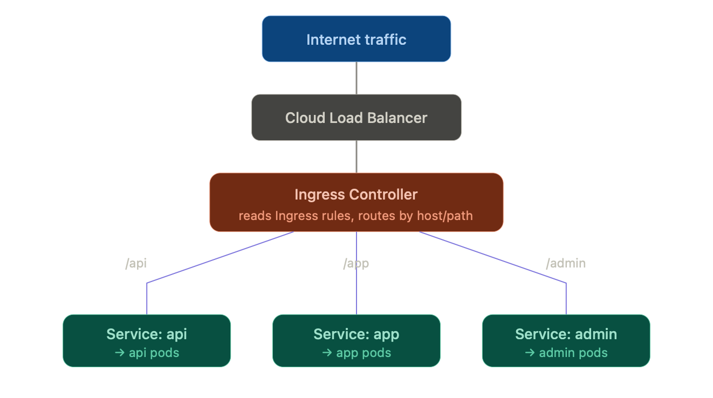

# Kubernetes Ingress — Complete Notes

## 1. The Core Problem

By default, nothing outside the cluster can reach your app. Pods have internal IPs, and a **Service** (ClusterIP) only gives stable access *inside* the cluster. You need a way to expose apps to the outside world — and to do it efficiently as the number of services grows.

---

## 2. The Three Ways to Expose Something Externally

| Method | How it works | Downside |
|---|---|---|
| **ClusterIP** (default) | Internal-only access | Not exposed externally at all |
| **NodePort** | Opens a specific port on every node's IP | Random high ports, no domain routing, no TLS handling — ugly |
| **LoadBalancer** | Spins up a real cloud load balancer per Service | 1 Service = 1 load balancer → expensive at scale, no smart routing |
| **Ingress** | One entry point, smart routing to multiple services | Requires installing a controller separately |

**Why Ingress wins:** 10 services behind separate `LoadBalancer` Services = 10 cloud load balancers = 10x the cost. 10 services behind one Ingress = **1** load balancer with host/path-based routing, centralized TLS, and extras like rate limiting — all in one place.

### Analogy
Ingress is like the **reception desk of an office building**. Without it, every department needs its own street entrance (LoadBalancer) — expensive and messy. With Ingress, there's one front door; the receptionist reads who you're asking for and routes you internally to the right department.

### Routing Flow Diagram



Traffic flows in one direction: it hits a single cloud load balancer, gets picked up by the Ingress Controller, which reads the Ingress rules and forwards each request to the right backend Service based on host/path — and each Service fronts its own set of pods.

---

## 3. Ingress vs Ingress Controller (the part everyone confuses)

- **Ingress (the object/YAML)** = just a set of **routing rules**. Purely declarative. Does nothing by itself.
- **Ingress Controller** = the actual software running in your cluster that *reads* those rules and does the real work.

**Without a controller running, an Ingress object does literally nothing.**

### What an Ingress Controller actually does, step by step
1. **Watches the Kubernetes API** for Ingress objects being created/updated/deleted
2. **Generates a reverse-proxy config** from those rules (e.g., turns YAML into an actual NGINX config, or an AWS ALB listener rule)
3. **Accepts incoming traffic** — either directly via its own proxy pods (fronted by a cloud LB), or by provisioning a cloud load balancer itself
4. **Terminates TLS** — decrypts HTTPS using the cert from a Secret, so backend pods just get plain HTTP
5. **Routes each request** to the correct backend Service based on host/path matching
6. **Applies extra behavior** via annotations — rate limiting, auth, redirects, rewrites, canary/weighted routing, compression, etc. (varies by controller)

---

## 4. How to Write an Ingress — Basic YAML

```yaml
apiVersion: networking.k8s.io/v1
kind: Ingress
metadata:
  name: my-app-ingress
  annotations:
    nginx.ingress.kubernetes.io/rewrite-target: /
spec:
  rules:
    - host: myapp.com
      http:
        paths:
          - path: /api
            pathType: Prefix
            backend:
              service:
                name: api-service
                port:
                  number: 80
          - path: /app
            pathType: Prefix
            backend:
              service:
                name: app-service
                port:
                  number: 80
```

### Field reference
| Field | Purpose |
|---|---|
| `host` | Route based on domain name (e.g., `api.myapp.com` vs `admin.myapp.com`) |
| `path` + `pathType` | Route based on URL path (`/api`, `/app`, `/admin`) |
| `backend.service` | Which internal Service to forward matched traffic to |
| `annotations` | Controller-specific config (rewrite rules, rate limiting, auth, etc.) |

You can combine host-based and path-based routing, and add multiple `host` blocks under **one** Ingress resource, behind **one** load balancer.

---

## 5. Adding TLS (HTTPS)

```yaml
spec:
  tls:
    - hosts:
        - myapp.com
      secretName: myapp-tls-cert
  rules:
    - host: myapp.com
      # ...rest of rules
```

`secretName` points to a Kubernetes Secret holding the TLS cert + key. In production, this is almost always automated with **cert-manager**, which auto-issues and renews certs from Let's Encrypt.

---

## 6. Which Ingress Controller to Use

| Controller | Best for | Setup | Portability | Downside |
|---|---|---|---|---|
| **NGINX Ingress Controller** | Any cluster, any cloud — the safe default | Runs its own proxy pods; one external LB in front | Fully portable — same config on-prem, AWS, GCP, Azure | Extra hop (LB → controller pods → service) |
| **AWS Load Balancer Controller** | EKS users wanting native AWS integration | Provisions a real ALB directly, no proxy hop | AWS-only | Locked into AWS-specific annotations |
| **Traefik** | Teams wanting simpler config + built-in dashboard | Runs its own proxy pods, similar to NGINX | Fully portable | Smaller ecosystem than NGINX for edge cases |

### Recommendation
- **Learning / general use / multi-cloud** → **NGINX Ingress Controller** (the de facto standard, most tutorials/answers use it)
- **All-in on AWS EKS** → **AWS Load Balancer Controller** (native ALB, ACM, WAF integration)
- **Doing service mesh / advanced traffic splitting / mTLS** → look at **Istio Gateway** or the newer **Gateway API** instead (bigger topic, not needed for typical setups)

---

## 7. Installing NGINX Ingress Controller on Docker Desktop

Docker Desktop's built-in Kubernetes is a bare, minimal single-node cluster — it does **not** ship with any Ingress Controller pre-installed. You must install it yourself.

### Option A — kubectl manifest
```bash
kubectl apply -f https://raw.githubusercontent.com/kubernetes/ingress-nginx/controller-v1.11.2/deploy/static/provider/cloud/deploy.yaml
```

### Option B — Helm (cleaner, easier to manage/upgrade)
```bash
helm repo add ingress-nginx https://kubernetes.github.io/ingress-nginx
helm repo update
helm install ingress-nginx ingress-nginx/ingress-nginx \
  --namespace ingress-nginx --create-namespace
```

### Verify it's running
```bash
kubectl get pods -n ingress-nginx
```
Look for `ingress-nginx-controller-xxxxx` in `Running` state.

### Docker Desktop quirk
`LoadBalancer` type Services don't get a real external IP like on AWS/GCP — Docker Desktop simulates this and maps it to `localhost` automatically. Once the controller is running, `http://localhost` routes to it.

---

## 7a. Testing Host-Based Routing Locally — Editing `/etc/hosts`

### Why this is needed
If your Ingress rule uses `host: blog.local` (a fake, non-registered domain), typing `http://blog.local` in your browser will fail — `blog.local` doesn't exist anywhere on the public internet's DNS system, so there's no DNS server that can resolve it to an IP.

The **hosts file** is a local override that sits *before* your computer asks the internet's DNS system anything. It's a plain text file mapping names to IPs manually, on your own machine only. Adding an entry there tells your computer: "don't bother asking DNS for this name — just use this IP directly."

```
127.0.0.1  blog.local
```

`127.0.0.1` is the universal "loopback" address — it always means **this same machine**. Since Docker Desktop's Ingress Controller is bound to your own machine's `localhost`, pointing `blog.local` at `127.0.0.1` routes it straight into your local cluster's Ingress Controller.

**Note:** multiple names can point to the same IP with no conflict — `localhost` and `blog.local` both resolving to `127.0.0.1` is fine. DNS resolution (name → IP) and HTTP routing (which app handles the request) are separate steps: the IP just gets you to the right *machine*; the `Host` header in the actual HTTP request is what the Ingress Controller reads to decide which backend Service to route to.

### How to edit it on Mac

The file lives at `/etc/hosts` and requires `sudo` (admin) privileges to edit.

**Option 1 — nano (easiest)**
```bash
sudo nano /etc/hosts
```
- Enter your Mac password when prompted (no characters will show — that's normal)
- Move to the bottom of the file, add: `127.0.0.1  blog.local`
- Save: `Ctrl + O`, then `Enter`
- Exit: `Ctrl + X`

**Option 2 — vim**
```bash
sudo vim /etc/hosts
```
- Press `i` to enter insert mode
- Add the line at the bottom
- Press `Esc`, type `:wq`, hit `Enter` to save and quit

**Option 3 — one-liner (no editor)**
```bash
echo "127.0.0.1  blog.local" | sudo tee -a /etc/hosts
```

### Verify it worked
```bash
cat /etc/hosts
```
You should see your new line alongside the defaults:
```
127.0.0.1  localhost
127.0.0.1  blog.local
```

Test resolution:
```bash
ping blog.local
```
It should resolve to `127.0.0.1` (`Ctrl+C` to stop — you're just confirming resolution, not a response).

### If you get "Permission denied"
- Confirm `sudo` is actually in the command
- Check for an immutable file lock: `ls -lO /etc/hosts` — if you see `uchg` or `schg` in the flags, unlock it with `sudo chflags nouchg /etc/hosts`, then retry
- Confirm sudo works at all: `sudo whoami` should print `root`

### Production note
This hosts file trick is purely a **local development convenience**. In production, you'd instead own a real domain and point its DNS `A` record at your cloud provider's real Ingress load balancer IP — no hosts file editing needed, since real DNS servers everywhere would resolve it correctly.

---

## 8. How This Fits Into the Bigger Picture

Typical production flow for a stateless web app:

```
Deployment (stateless app pods)
      → Service (stable internal access)
            → Ingress + Ingress Controller (external entry point, routing, TLS)
```

- If using **RDS** for your database: app pods (Deployment) connect out to RDS directly — RDS itself is never exposed via Ingress, it's accessed over the network by your app pods.
- If running something stateful **in-cluster** (Kafka, Elasticsearch, Redis — via StatefulSet): these are usually **not** exposed via Ingress. They stay internal-only, accessed by other pods through their Service, not the public internet.

---

## 9. Quick Reference Cheatsheet

- Ingress object = rules only, does nothing without a controller
- Ingress Controller = the pod(s) actually doing the routing/proxying/TLS work
- `kubectl get ingress` → see your Ingress rules and their assigned address
- `kubectl get pods -n ingress-nginx` → check controller health
- Path-based routing: `/api`, `/app`, `/admin` on the same host
- Host-based routing: `api.myapp.com`, `admin.myapp.com` as separate rule blocks
- TLS termination happens at the controller — backend pods see plain HTTP
- On Docker Desktop, `LoadBalancer` Services auto-map to `localhost`
- Default recommendation to start with: **NGINX Ingress Controller**