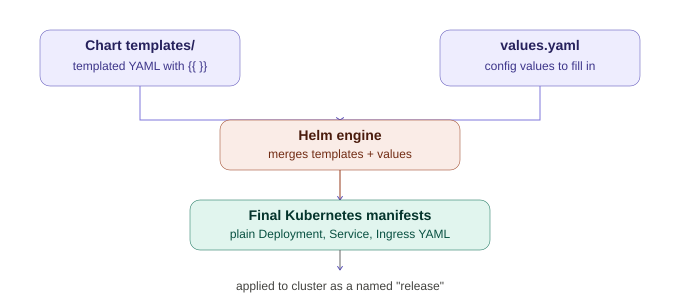

# Helm — Complete Notes

## 1. The Core Problem Helm Solves

For even one app, you end up hand-writing multiple YAML files: a Deployment, a Service, an Ingress, an HPA, maybe a ConfigMap/Secret. This gets painful once you need to:

- Deploy the **same app** to dev, staging, and prod — each needing different replica counts, image tags, resource limits
- **Upgrade** later without manually editing and re-applying every file
- **Roll back** instantly when something breaks after a deploy
- **Install someone else's app** (e.g. an Ingress Controller) without hand-writing hundreds of lines of YAML yourself

Doing all this with raw `kubectl apply -f` and copy-pasted YAML gets messy fast. Helm exists to fix exactly this.

---

## 2. What Helm Actually Is

**Helm is the package manager for Kubernetes** — think `npm` for Node.js, or `apt`/`brew` for your OS, but for k8s applications.

| Term | Meaning |
|---|---|
| **Chart** | A package — a bundle of templated YAML files describing an app (like an npm package) |
| **Release** | A specific installed *instance* of a chart running in your cluster (you can install the same chart multiple times with different names/configs) |
| **Repository** | A place charts are stored and shared from (like the npm registry, or Artifact Hub) |

You've already used this: installing `ingress-nginx` via Helm pulled in dozens of resources (Deployments, Services, ClusterRoles, ConfigMaps, webhooks) that would've taken hundreds of lines of hand-written YAML.

---

## 3. How Helm Renders a Chart — The Core Mechanism

You write your YAML **once**, as a template with placeholders. Helm fills in the actual values at install time. Same chart, different `values.yaml` per environment = same app, deployed differently to dev/staging/prod, with no duplicated files.



---

## 4. Using Existing Charts (Package-Manager Style)

```bash
helm repo add bitnami https://charts.bitnami.com/bitnami   # add a chart repo
helm search repo mysql                                       # search available charts
helm install my-release bitnami/mysql                        # install it
helm list                                                     # see installed releases
helm upgrade my-release bitnami/mysql -f custom-values.yaml   # upgrade with new config
helm rollback my-release 1                                    # roll back to revision 1
helm uninstall my-release                                     # remove it
```

Every `helm install`/`helm upgrade` is tracked as a numbered **revision** — this is what makes rollback trivial. `helm history my-release` shows every past revision.

---

## 5. Creating Your Own Chart

```bash
helm create planner-chart
```

Scaffolds a standard folder structure:

```
planner-chart/
├── Chart.yaml           # metadata: name, version, description
├── values.yaml          # default config values
├── templates/
│   ├── deployment.yaml
│   ├── service.yaml
│   ├── ingress.yaml
│   ├── hpa.yaml
│   ├── _helpers.tpl     # reusable template snippets/functions
│   └── NOTES.txt         # message shown after install
└── charts/               # subcharts/dependencies go here
```

### Turning existing YAML into a template

**`values.yaml`**
```yaml
replicaCount: 2
image:
  repository: myrepo/planner
  tag: "1.0"
service:
  port: 8082
ingress:
  host: blog.local
```

**`templates/deployment.yaml`**
```yaml
apiVersion: apps/v1
kind: Deployment
metadata:
  name: planner-deployment
spec:
  replicas: {{ .Values.replicaCount }}
  selector:
    matchLabels:
      app: planner
  template:
    metadata:
      labels:
        app: planner
    spec:
      containers:
        - name: planner
          image: "{{ .Values.image.repository }}:{{ .Values.image.tag }}"
          ports:
            - containerPort: 8080
```

`{{ .Values.xxx }}` pulls values straight from `values.yaml` — this is Go template syntax, Helm's templating language. Apply the same pattern to `service.yaml`, `ingress.yaml`, etc. — replace anything environment-specific with `{{ .Values.something }}`.

### Testing and installing your own chart

```bash
helm lint ./planner-chart              # check for syntax/structural errors
helm template ./planner-chart          # render the YAML locally without installing (great for debugging)
helm install planner ./planner-chart   # actually install it
helm upgrade planner ./planner-chart --set replicaCount=5   # override a value on the fly
```

`--set` overrides a single value from the command line; `-f other-values.yaml` swaps in a whole different values file — this is how the same chart deploys differently to dev vs prod:
```bash
helm install planner ./planner-chart -f values-dev.yaml
helm install planner ./planner-chart -f values-prod.yaml
```

---

## 6. Creating a Chart ≠ Deploying It (Important Distinction)

**Creating the chart** (`helm create`) only writes template files + `values.yaml` to your local filesystem. Nothing is sent to Kubernetes — it's a blueprint, exactly like a Dockerfile doesn't build/run a container just by existing.

**`helm install`** is the step that actually does something:
1. Reads your templates + `values.yaml`
2. **Renders** them into real, plain Kubernetes YAML (substituting `{{ .Values.xxx }}` with actual values)
3. **Sends that rendered YAML to your cluster** (like an automated `kubectl apply -f`)
4. **Tracks the whole thing as a release** — name, revision number, and history

### Could you skip `helm install` and use `kubectl apply` instead?

Technically yes: `helm template ./planner-chart > output.yaml` then `kubectl apply -f output.yaml`. But you lose the entire point of Helm:

| Lost without `helm install` | Why it matters |
|---|---|
| Release tracking | No record that "planner" is installed, no revision history |
| `helm upgrade` | Must manually diff and reapply YAML on every change |
| `helm rollback` | No easy "go back to the version before this broke" |
| `helm uninstall` | No clean, automatic teardown of everything the chart created |
| `helm list` | No single command to see what Helm-managed apps are running |

### Mental model
- **Writing the chart** = writing a recipe
- **`helm install`** = actually cooking the meal and serving it, while logging every version cooked so you can redo or undo it

```bash
helm create planner-chart              # write the blueprint (local only, once)
helm install planner ./planner-chart   # first deploy
# ...edit templates/values.yaml...
helm upgrade planner ./planner-chart   # deploy the changes
```

---

## 7. What Happens on `helm uninstall`

```bash
helm uninstall planner
```

Step by step:
1. Helm looks up the release named `planner` and finds every resource it created — Deployment, Service, Ingress, HPA, ConfigMaps, Secrets, everything from that chart's templates.
2. It **deletes all of those resources** from the cluster, roughly in reverse creation order.
3. It **removes the release record itself** — revision history, tracked release name, all of it.

After running it, `kubectl get pods/svc/ingress` for that app will show nothing — genuinely deleted, not just "forgotten" by Helm.

### Why this beats raw `kubectl delete`
Without Helm you'd need to remember and run a separate `kubectl delete` for every resource type you created. Miss one, and you get orphaned resources sitting around silently. `helm uninstall` guarantees everything that release owns gets cleaned up together, because Helm tracked ownership from the moment of `helm install`.

### Important exception — persistent data is NOT always deleted
By default, Helm does **not** delete PersistentVolumeClaims created via `volumeClaimTemplates` in a StatefulSet, even on uninstall — intentional, so tearing down an app doesn't accidentally wipe database data.

```bash
helm uninstall planner
kubectl get pvc   # <-- these likely still exist!
```

Delete manually if you actually want the data gone:
```bash
kubectl delete pvc -l app=mysql
```

Same safety principle as StatefulSets in general: Kubernetes (and Helm) intentionally makes it hard to accidentally destroy persistent data.

### Verification commands
```bash
helm list                    # confirm the release is gone
helm history planner         # will fail/show nothing — release no longer exists
```

### Mental model, continued
If `helm install` was "cook the meal and serve it," `helm uninstall` is "clear the table completely" — but it deliberately leaves the pantry (your persistent data) untouched, in case you want to cook the same meal again later.

---

## 8. Full Walkthrough — Building a Chart for the Planner App

### Step 1 — Scaffold the chart
```bash
helm create planner-chart
cd planner-chart
rm templates/tests -rf
rm templates/*.yaml
```
Delete Helm's default sample templates — you'll write your own from scratch using your existing YAML as the base.

### Step 2 — Set up multiple values files (this is how dev vs prod works)

Instead of one `values.yaml`, use **three** files:

**`values.yaml`** (defaults / fallback)
```yaml
replicaCount: 2
image:
  repository: myrepo/planner
  tag: "1.0"
service:
  port: 8082
ingress:
  host: blog.local
```

**`values-dev.yaml`** (overrides for dev)
```yaml
replicaCount: 1
image:
  tag: "dev-latest"
ingress:
  host: blog.local
```

**`values-prod.yaml`** (overrides for prod)
```yaml
replicaCount: 5
image:
  tag: "1.0-stable"
ingress:
  host: planner.mycompany.com
```

You only need to specify what's *different* — anything not overridden falls back to `values.yaml`.

### Step 3 — Write templates using `{{ .Values.x }}` for anything env-specific

**`templates/deployment.yaml`**
```yaml
apiVersion: apps/v1
kind: Deployment
metadata:
  name: planner-deployment
spec:
  replicas: {{ .Values.replicaCount }}
  selector:
    matchLabels:
      app: planner
  template:
    metadata:
      labels:
        app: planner
    spec:
      containers:
        - name: planner
          image: "{{ .Values.image.repository }}:{{ .Values.image.tag }}"
          ports:
            - containerPort: 8080
```

**`templates/service.yaml`**
```yaml
apiVersion: v1
kind: Service
metadata:
  name: planner-service
spec:
  selector:
    app: planner
  ports:
    - port: {{ .Values.service.port }}
      targetPort: 8080
```

**`templates/ingress.yaml`**
```yaml
apiVersion: networking.k8s.io/v1
kind: Ingress
metadata:
  name: planner-ingress
spec:
  ingressClassName: nginx
  rules:
    - host: {{ .Values.ingress.host }}
      http:
        paths:
          - path: /
            pathType: Prefix
            backend:
              service:
                name: planner-service
                port:
                  number: {{ .Values.service.port }}
```

### Step 4 — Validate before installing (always do this)
```bash
helm lint ./planner-chart
helm template planner ./planner-chart -f values-dev.yaml   # dry-run: renders YAML, no cluster changes
```
Read through the rendered output before actually deploying — this is your safety net.

### Step 5 — Install for dev
```bash
helm install planner ./planner-chart -f values-dev.yaml
helm list
kubectl get all
```
You should see 1 replica, `dev-latest` tag, `blog.local` as the host — matching `values-dev.yaml`.

### Step 6 — Update a specific key-value pair

**A) One-off, temporary override (fastest)**
```bash
helm upgrade planner ./planner-chart -f values-dev.yaml --set replicaCount=3
```
`--set` overrides just that key on top of whatever values file you passed — good for quick testing.

**B) Permanent change (the proper way)**
Edit `values-dev.yaml` directly, then:
```bash
helm upgrade planner ./planner-chart -f values-dev.yaml
```
Preferred for anything you want tracked in version control.

Verify:
```bash
kubectl get deployment planner-deployment
helm history planner
```

### Step 7 — Switching from dev to prod

You don't edit an "env file" — you **swap which values file you point Helm at**:
```bash
helm upgrade planner ./planner-chart -f values-prod.yaml
```
Same chart, same templates — replica count jumps to 5, image tag changes, ingress host switches, all in one command.

To run dev and prod **simultaneously** as separate releases (e.g. different namespaces) instead of migrating one release:
```bash
helm install planner-prod ./planner-chart -f values-prod.yaml --namespace prod --create-namespace
```

### Step 8 — If an upgrade breaks something
```bash
helm history planner       # find the last good revision number
helm rollback planner 2    # revert to revision 2
```

### Full lifecycle, summarized
```bash
helm create planner-chart
helm lint ./planner-chart
helm template planner ./planner-chart -f values-dev.yaml
helm install planner ./planner-chart -f values-dev.yaml
helm upgrade planner ./planner-chart --set replicaCount=3
helm upgrade planner ./planner-chart -f values-prod.yaml
helm rollback planner 2
helm uninstall planner
```

---

## 9. Does `helm upgrade` / `--set` Cause Downtime?

**Usually no, if configured correctly** — but a few situations can cause a brief gap.

### Default behavior: rolling updates
`helm upgrade` re-applies the Deployment YAML with new values. Kubernetes Deployments use a **RollingUpdate** strategy by default:
1. Spins up new pod(s) with the updated image/config
2. Waits for the new pod to become **Ready** (passes its readiness probe)
3. Only then terminates an old pod
4. Repeats until all pods are replaced

At every point, at least one pod (old or new) is serving traffic — that's the whole point of rolling updates.

### When it protects you vs when it doesn't

| Scenario | Downtime? | Why |
|---|---|---|
| `replicaCount: 3+`, rolling update, readiness probe configured | No | Always 2+ pods available while 1 rotates out |
| `replicaCount: 1` | Yes, briefly | Only one pod exists — it has to cycle before/while the new one starts |
| No readiness probe defined | Risky | K8s may route traffic to a new pod before the app has actually finished starting, causing failed requests |
| Slow image pull (new tag not cached) | Slight delay, not downtime | New pod stays "not ready" longer, but old pods keep serving meanwhile |
| `--set` changing `service.port` / `ingress.host` | Possible tiny blip | Service/Ingress updates propagate near-instantly, but a few seconds of DNS/routing catch-up can occur |

**Your dev config (`replicaCount: 1`)** is the one case where you can genuinely see brief downtime on every upgrade — expected and fine for dev, and exactly why prod uses more replicas.

### Guaranteeing true zero-downtime (for prod)
```yaml
spec:
  replicas: {{ .Values.replicaCount }}
  strategy:
    rollingUpdate:
      maxUnavailable: 0   # never drop below full capacity
      maxSurge: 1         # allow one extra pod temporarily during rollout
    type: RollingUpdate
  template:
    spec:
      containers:
        - name: planner
          readinessProbe:
            httpGet:
              path: /health
              port: 8080
            initialDelaySeconds: 5
            periodSeconds: 5
```
- `maxUnavailable: 0` — guarantees old pod count never drops before a new one is confirmed ready
- `readinessProbe` — the actual mechanism preventing traffic from hitting a pod that isn't truly ready; without it, K8s assumes a pod is ready the instant it starts

### What about the StatefulSet (MySQL)?
StatefulSets update pods **one at a time, in strict reverse order** (highest ordinal first, e.g. `db-2` → `db-1` → `db-0`), never in parallel — this protects data consistency during replication. Rollouts are inherently slower, but as long as multiple replicas exist and replication is healthy, reads/writes can still be served by pods not currently being updated.

### Bottom line
- `values-dev.yaml` (`replicaCount: 1`) → expect a brief blip on every upgrade — fine for dev
- `values-prod.yaml` (`replicaCount: 5`) → truly zero-downtime with a proper readiness probe + `maxUnavailable: 0` — the real reason prod runs more than 1 replica, beyond just scaling

---

## 10. Quick Reference Cheatsheet

| Command | What it does |
|---|---|
| `helm repo add <name> <url>` | Add a chart repository |
| `helm search repo <term>` | Search for charts in added repos |
| `helm create <chart-name>` | Scaffold a new chart locally (no cluster changes) |
| `helm lint <chart-path>` | Check chart for syntax/structural errors |
| `helm template <chart-path>` | Render final YAML locally, without installing |
| `helm install <release> <chart>` | Deploy the chart to the cluster as a named release |
| `helm upgrade <release> <chart>` | Apply changes to an existing release |
| `helm upgrade <release> <chart> --set key=value` | Override a single value at deploy time |
| `helm upgrade <release> <chart> -f values-x.yaml` | Deploy with a different values file (per environment) |
| `helm rollback <release> <revision>` | Revert to a previous revision |
| `helm history <release>` | List all past revisions of a release |
| `helm list` | Show all installed releases |
| `helm uninstall <release>` | Remove the release and all its resources (PVCs usually kept) |

### When Helm is worth it
Multiple environments, need reliable rollbacks, managing several interrelated YAML files, or want to install/share a full app with one command.

### When it's not worth it
A single quick throwaway app you're testing once — raw `kubectl apply -f` is simpler for that.