# Razorpay Payment Gateway Integration Guide

Complete reference for Razorpay payment integration in the **EasyBuy (MicroDevops)** platform.

## 💡 First Read This: Complete Flow in Simplest Language Possible

1. **User clicks checkout** $\rightarrow$ Checkout will reserve the stock and make async calls to payment and notification.
2. **Payment creates order**: Now payment will create an order on Razorpay by making an HTTP call and get the Razorpay `order_id` (or simply a normal order ID).
3. **Frontend fetches order**: Now it is the duty of frontend to call this endpoint `/order/{orderId}` to get that `orderId` which we got from Razorpay.
4. **User pays**: Now frontend will open a payment page and do the payment. During this, the frontend will call Razorpay and Razorpay will deduct the money and send 3 things:
   - `paymentId`
   - `orderId`
   - `signature`
5. **Backend verifies**: Now frontend will call our `/verify` endpoint and then our backend will again come into the picture and do the verification and send a message in Kafka topic for `cart-order-service` and then `cart-order-service` will work accordingly.


### Why Webhooks are Needed:

* **The Problem**: Now imagine the user made the payment, but due to some reason the `/verify` endpoint is not called by the frontend — then the payment status will always remain `PENDING` and the user will get angry because money is deducted from his account but the order is not yet placed properly.
* **The Solution**: So in this scenario, Razorpay will call our `/webhook` endpoint directly and send the info about whether the payment was successful or not, and then our backend will mark the payment as success or fail accordingly.
* **Setting up Webhook endpoint**: You have to set up a webhook end point which razerpay will call so that your service can verify that payment request. Set `https://<your-public-domain>/payment-service/api/v1/payments/webhook` as your webhook URL and give the same secret which you have stored inside your application.properties : `razorpay.webhook.secret`
* **API gateway Setup**: You need to add a filter for payment service as well so that request can come inside payment method form gateway. and also make the `/webhook` public so that it does not need a JWT Token.

---

## 1. High-Level Architecture Overview

### A. The Big Picture: 3 Simple Stages

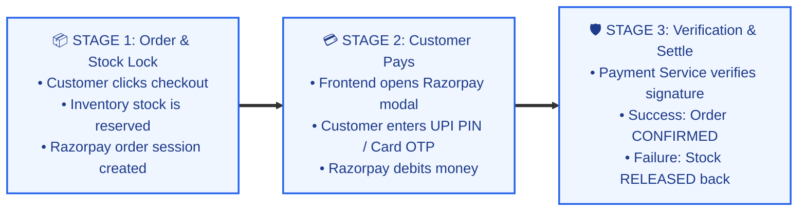

---

### B. Complete End-to-End Payment Flow (Step-by-Step Pipeline)

Follow the numbers from **1 to 11**:

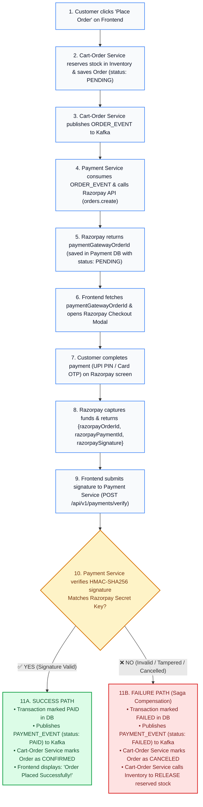

---

### C. Component Architecture & Data Flow (Who Talks to Whom)

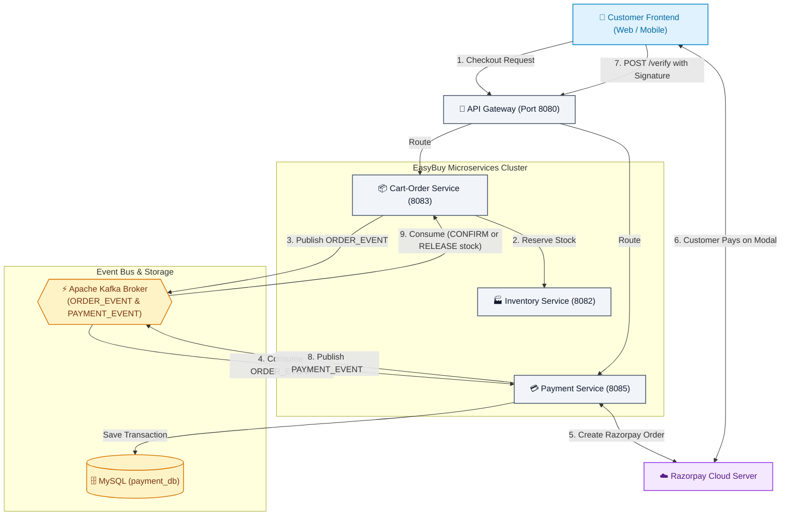

---

### D. Step-by-Step Flow Summary Table

| Step | Actor | Action | Data / Key Variables Involved |
| :---: | :--- | :--- | :--- |
| **1** | Customer Frontend | Calls checkout API via Gateway | `userId`, cart items |
| **2** | Cart-Order Service | Reserves stock in Inventory & saves Order | `orderId`, `orderStatus: PENDING` |
| **3** | Cart-Order Service | Emits event to Kafka topic `ORDER_EVENT` | `orderId`, `amount`, `paymentMethod: ONLINE` |
| **4** | Payment Service | Consumes `ORDER_EVENT` & calls Razorpay API | Converts amount to paise (₹1,499.00 $\rightarrow$ `149900`) |
| **5** | Razorpay Cloud | Returns generated gateway order ID | `razorpay_order_id` (stored as `paymentGatewayOrderId`) |
| **6** | Customer Frontend | Fetches payment info & opens Razorpay modal | `razorpayKeyId`, `order_id: paymentGatewayOrderId` |
| **7** | Customer | Enters UPI PIN or Card OTP in modal | Bank processes payment |
| **8** | Razorpay Cloud | Returns digital proof to frontend | `razorpayOrderId`, `razorpayPaymentId`, `razorpaySignature` |
| **9** | Customer Frontend | Sends proof to backend for verification | `POST /api/v1/payments/verify` |
| **10** | Payment Service | Verifies signature via `Utils.verifyPaymentSignature` | Checks signature against secret key |
| **11A** | *Success Path* | Transaction marked `PAID`, emits `PAYMENT_EVENT` | Order marked `CONFIRMED` |
| **11B** | *Failure Path* | Transaction marked `FAILED`, emits `PAYMENT_EVENT` | Order marked `CANCELED`, **stock released** |

---

### E. Microservice Responsibilities

| Service | Main Job | Payment Role |
| :--- | :--- | :--- |
| **`cart-order-service`** | Manages carts and orders | Reserves stock, emits `ORDER_EVENT`, updates order status |
| **`payment-service`** | Handles payments and transactions | Creates Razorpay orders, verifies signatures, emits `PAYMENT_EVENT` |
| **`inventory-service`** | Manages product inventory | Reserves stock on checkout; releases stock if payment fails |
| **Razorpay Gateway** | External payment provider | Collects customer payments (Cards, UPI, Netbanking) and returns signed tokens |

---

## 2. Complete Step-by-Step Payment Lifecycle

Divided into **3 clear phases** for easy reading:

---

### Phase 1: Order Checkout & Razorpay Order Creation

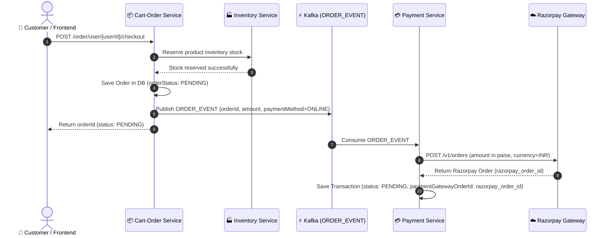

---

### Phase 2: Customer Modal Checkout (Browser / Mobile UI)

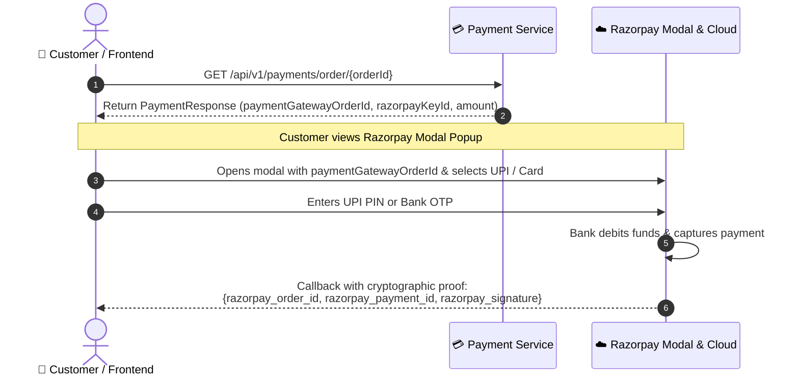

---

### Phase 3A: Signature Verification & Order Confirmation (Success Path)

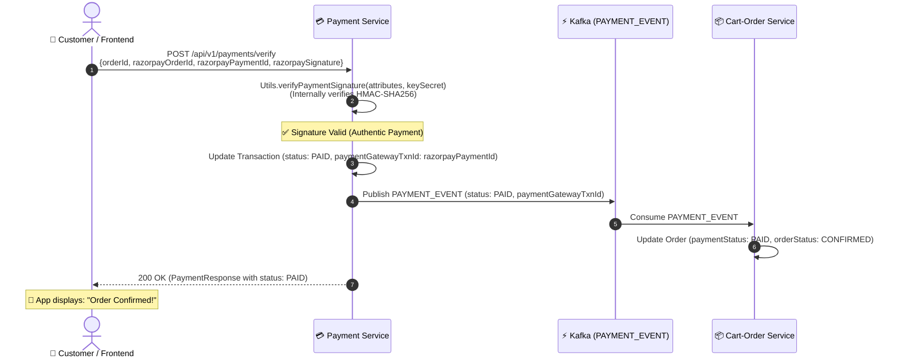

---

### Phase 3B: Payment Failure & Inventory Release (Failure Path / Saga Compensation)

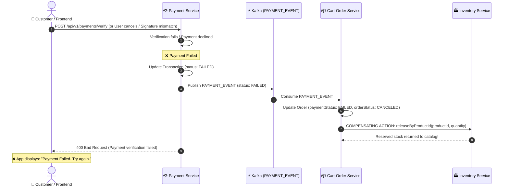

---

### Code Breakdown of Steps

#### 1. Stock Lock & Order Creation
- `cart-order-service` calls `inventory-service` to hold stock so items don't oversell.
- Order saved with `orderStatus = PENDING`.
- `ORDER_EVENT` published to Kafka.

#### 2. Razorpay Order Creation
- `payment-service` picks up `ORDER_EVENT`.
- Converts amount to **paise** (1 INR = 100 paise).
- Calls Razorpay API: `razorpayClient.orders.create(...)`.
- Saves `Transaction` in MySQL with `status = PENDING` and `paymentGatewayOrderId = razorpay_order_id`.

#### 3. Frontend Modal Checkout
- Frontend loads Razorpay JS SDK with `paymentGatewayOrderId` and `razorpayKeyId`:
  ```javascript
  const options = {
    key: response.razorpayKeyId,
    order_id: response.paymentGatewayOrderId, // <-- razorpay_order_id
    amount: response.amount * 100,
    currency: "INR",
    name: "EasyBuy",
    handler: function (razorpayResponse) {
      // Send to backend verify
      verifyPayment(razorpayResponse);
    }
  };
  new Razorpay(options).open();
  ```

#### 4. Signature Verification (Anti-Fraud)
- **Why**: Frontend runs in the browser where anyone can inspect element and fake a success response. Verification proves to backend that Razorpay actually collected the money.
- **Code in `PaymentServiceImpl.java`**:
  ```java
  JSONObject attributes = new JSONObject();
  attributes.put("razorpay_order_id", request.getRazorpayOrderId());
  attributes.put("razorpay_payment_id", request.getRazorpayPaymentId());
  attributes.put("razorpay_signature", request.getRazorpaySignature());

  boolean isValid = Utils.verifyPaymentSignature(attributes, razorpayConfig.getKeySecret());
  ```
- **How it works under the hood**: Razorpay's `Utils.verifyPaymentSignature` computes `HMAC-SHA256(order_id + "|" + payment_id, secret)` and compares it to `razorpay_signature`.
  - If match: Payment is authentic. Transaction marked `PAID`.
  - If no match: Payment is tampered or failed. Transaction marked `FAILED`.

#### 5. Order Confirmation
- On success: Emits `PAYMENT_EVENT (PAID)` to Kafka.
- `cart-order-service` updates order to `CONFIRMED`.

---

## 3. How Frontend Gets Data While Payment is PENDING

> **Rule**: Kafka is strictly an internal backend bus. Browsers communicate only via **HTTP REST APIs**.

### A. Variable Names Mapping Table

| Field Meaning | DB Entity (`Transaction`) | REST JSON (`PaymentResponse`) | Razorpay Modal Input | Razorpay Modal Output | Verify Payload (`PaymentVerificationRequest`) |
| :--- | :--- | :--- | :--- | :--- | :--- |
| **Internal Order ID** | `orderId` | `orderId` | `notes.orderId` | - | `orderId` |
| **Razorpay Order ID** | `paymentGatewayOrderId` | `paymentGatewayOrderId` | `order_id` | `razorpay_order_id` | `razorpayOrderId` |
| **Razorpay Payment ID** | `paymentGatewayTxnId` | `paymentGatewayTxnId` | - | `razorpay_payment_id` | `razorpayPaymentId` |
| **HMAC Signature** | `paymentGatewaySignature` | `paymentGatewaySignature` | - | `razorpay_signature` | `razorpaySignature` |
| **Public Key ID** | - | `razorpayKeyId` | `key` | - | - |
| **Currency** | - | `currency` | `currency` | - | - |
| **Status** | `status` | `status` | - | - | - |

---

### B. Frontend Flow

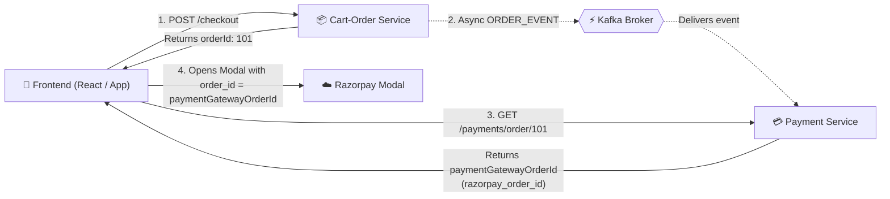

1. **`POST /checkout`**: Returns `{ orderId: 101, paymentStatus: "PENDING" }` to frontend.
2. **Kafka Background**: `payment-service` consumes event, creates Razorpay order, saves `paymentGatewayOrderId`.
3. **`GET /payments/order/101`**: Frontend fetches `paymentGatewayOrderId` and `razorpayKeyId`.
4. **Open Modal**: Frontend opens Razorpay modal with `order_id`.

---

### C. While Payment Is PENDING

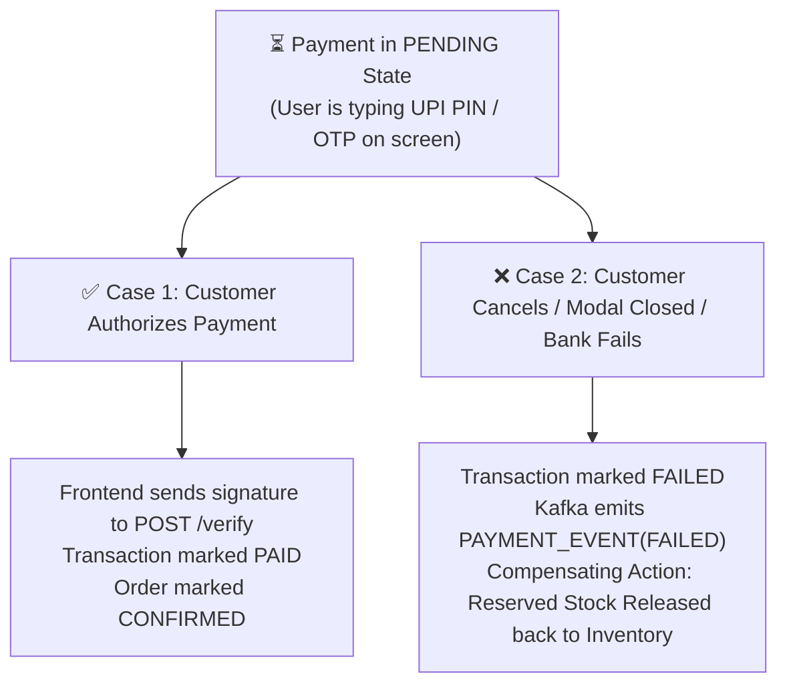

- **Stock**: Held in `inventory-service` so others cannot buy it.
- **Database**: Order and Transaction remain `PENDING`.

---

## 4. How Failed Payments Are Handled (Saga Pattern)

If payment fails, reserved stock must be released back to the catalog.

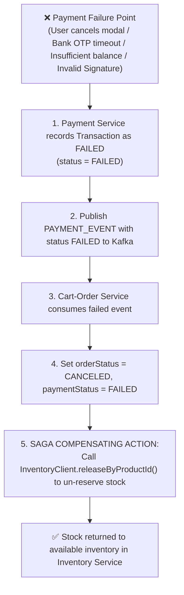

### Failure Scenarios:
1. **User cancels or bank declines**: Transaction marked `FAILED`, Kafka event emitted, `cart-order-service` cancels order and releases stock.
2. **Tampered signature**: Verification fails, transaction marked `FAILED`, stock released.
3. **Browser closed after payment**: Handled by webhooks (Section 5).

---

## 5. Webhook Architecture (Gateway Callbacks)

### What is a Webhook?
A direct, server-to-server HTTP call from Razorpay to our backend (`POST /api/v1/payments/webhook`). No browser is involved.

### Why is it Needed?
If a user's phone dies or browser closes right after entering OTP, the frontend never calls `/verify`. Webhooks ensure our backend still gets notified and confirms the order:

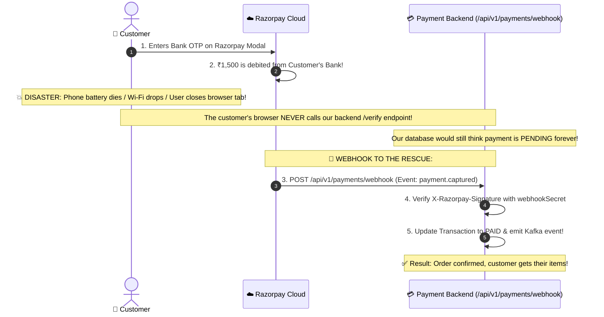

---

### Webhook Events Handled

| Event Name | Meaning | Backend Action |
| :--- | :--- | :--- |
| **`payment.captured`** | Money successfully debited from customer | Marks transaction `PAID`, emits `PAYMENT_EVENT (PAID)`, order confirmed |
| **`order.paid`** | Order amount fully paid | Marks transaction `PAID` |
| **`payment.failed`** | Bank declined payment | Marks transaction `FAILED`, emits `PAYMENT_EVENT (FAILED)`, stock released |

---

### Webhook Security (HMAC Verification)

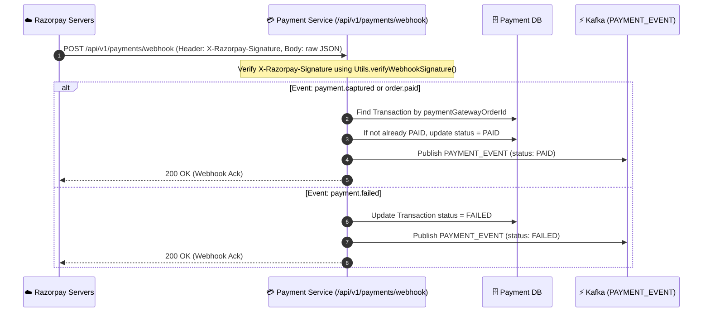

---

## 6. Code Walkthrough (Files Added & Modified)

1. **`payment-service/pom.xml`**: Added `com.razorpay:razorpay-java:1.4.10` dependency.
2. **`application.properties`**: Added `razorpay.key.id`, `razorpay.key.secret`, `razorpay.currency`, and `razorpay.webhook.secret` with mock defaults.
3. **`RazorpayConfig.java`**: Creates `RazorpayClient` bean and `isMockMode()` helper for testing without live keys.
4. **`PaymentVerificationRequest.java`**: DTO for `/verify` payload (`orderId`, `razorpayOrderId`, `razorpayPaymentId`, `razorpaySignature`).
5. **`PaymentResponse.java`**: Added `currency` and `razorpayKeyId` for frontend modal initialization.
6. **`PaymentRepository.java`**: Added `findByOrderId` and `findByPaymentGatewayOrderId` query methods.
7. **`PaymentServiceImpl.java`**:
   - `processPayment`: Converts amount to paise and creates Razorpay order.
   - `verifyPayment`: Verifies signature via `Utils.verifyPaymentSignature`, updates status, emits Kafka event.
   - `handleWebhook`: Validates `X-Razorpay-Signature` and updates status.
8. **`PaymentController.java`**: Endpoints for `/create-order`, `/verify`, `/webhook`, and `/order/{orderId}`.
9. **`OrderServiceImplementation.java`**: When payment fails, cancels order and calls `inventoryClient.releaseByProductId` to release reserved stock.

---

## 7. How to Use Real Razorpay Keys

1. Get test keys from [https://dashboard.razorpay.com](https://dashboard.razorpay.com) (**Settings** $\rightarrow$ **API Keys**).
2. Set keys in `payment-service/src/main/resources/application.properties`:
   ```properties
   razorpay.key.id=rzp_test_YOUR_ACTUAL_KEY_ID
   razorpay.key.secret=YOUR_ACTUAL_KEY_SECRET
   razorpay.currency=INR
   razorpay.webhook.secret=YOUR_WEBHOOK_SECRET
   ```
   Or set environment variables:
   ```bash
   export RAZORPAY_KEY_ID=rzp_test_YOUR_ACTUAL_KEY_ID
   export RAZORPAY_KEY_SECRET=YOUR_ACTUAL_KEY_SECRET
   ```

---

## 8. Sample API Requests

### 1. Create Order
```bash
curl -X POST http://localhost:8085/api/v1/payments/create-order \
  -H "Content-Type: application/json" \
  -d '{
    "orderId": 101,
    "totalAmount": 1499.00,
    "paymentMethod": "ONLINE",
    "paymentDetails": "Credit Card"
  }'
```

### 2. Verify Payment
```bash
curl -X POST http://localhost:8085/api/v1/payments/verify \
  -H "Content-Type: application/json" \
  -d '{
    "orderId": 101,
    "razorpayOrderId": "order_mock_79da6656f6824d",
    "razorpayPaymentId": "pay_O7f92K3b1L",
    "razorpaySignature": "mock_valid_signature"
  }'
```

### 3. Check Order Payment Status
```bash
curl -X GET http://localhost:8085/api/v1/payments/order/101
```
