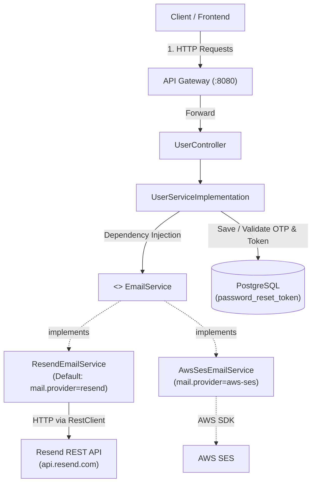
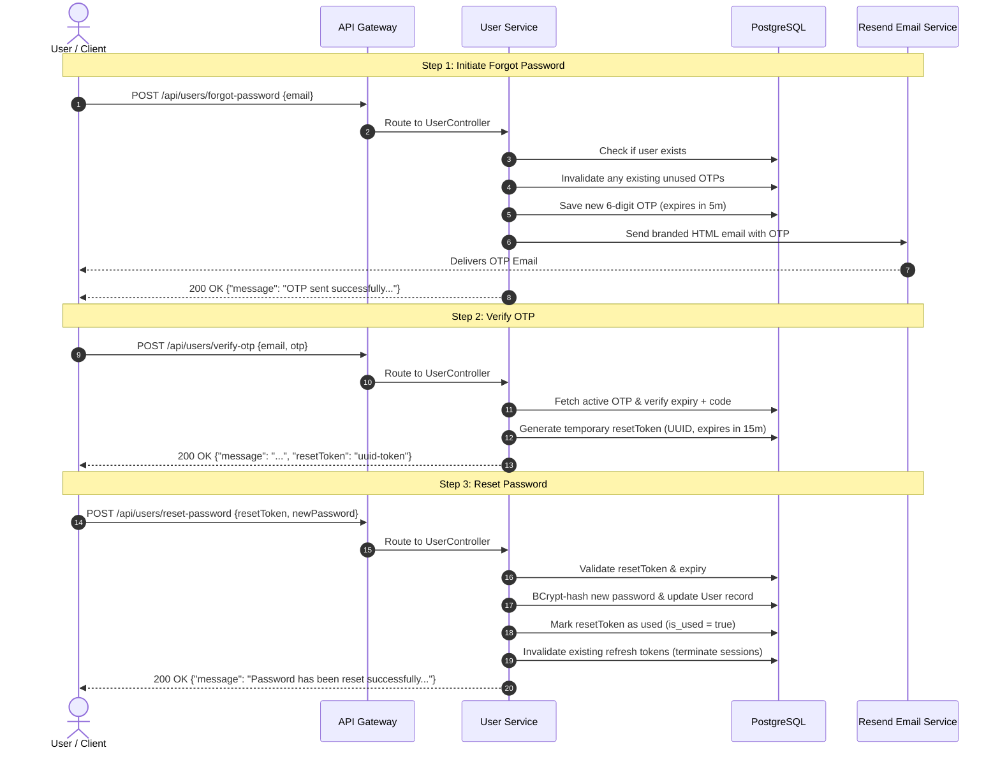

# Password Reset Architecture & Implementation Guide

This document describes the password reset flow in `user-service`, including OTP generation, email dispatch via Resend, verification, password reset, and migration to AWS SES.

---

## 1. Architecture Overview

### Component Diagram



---

## 2. End-to-End Workflow

The password reset operates in three distinct, secure steps:



---

## 3. Configuration Properties

Add the following properties to `user-service/src/main/resources/application.properties` (or the central config repository):

```properties
# ==========================================
# Email & Password Reset Configuration
# ==========================================

# Active mail provider: 'resend' (default) or 'aws-ses'
mail.provider=${MAIL_PROVIDER:resend}

# Resend API Configuration
resend.api-key=${RESEND_API_KEY:}
resend.from-email=${RESEND_FROM_EMAIL:EasyBuy <onboarding@resend.dev>}
resend.api-url=${RESEND_API_URL:https://api.resend.com/emails}

# OTP & Reset Token Security Timers (in minutes)
otp.expiration-minutes=${OTP_EXPIRATION_MINUTES:5}
otp.reset-token-expiration-minutes=${OTP_RESET_TOKEN_EXPIRATION_MINUTES:15}
```

### Property Reference Table

| Property Name | Env Variable Override | Default Value | Description |
| :--- | :--- | :--- | :--- |
| `mail.provider` | `MAIL_PROVIDER` | `resend` | Active email provider (`resend` or `aws-ses`). |
| `resend.api-key` | `RESEND_API_KEY` | *(empty)* | Resend API key (e.g. `re_123...`). **Required for Resend**. |
| `resend.from-email` | `RESEND_FROM_EMAIL` | `EasyBuy <onboarding@resend.dev>` | Sender email address. Use custom domain once verified in Resend. |
| `resend.api-url` | `RESEND_API_URL` | `https://api.resend.com/emails` | Resend REST API email endpoint. |
| `otp.expiration-minutes` | `OTP_EXPIRATION_MINUTES` | `5` | Time-to-live (minutes) for the 6-digit OTP. |
| `otp.reset-token-expiration-minutes` | `OTP_RESET_TOKEN_EXPIRATION_MINUTES` | `15` | Time-to-live (minutes) for the `resetToken` issued after OTP verification. |

---

## 4. API Specification & Examples

### 1. Request Password Reset OTP
* **Endpoint:** `POST /api/users/forgot-password`
* **Access:** Public

**Request:**
```http
POST /api/users/forgot-password
Content-Type: application/json

{
  "email": "customer@example.com"
}
```

**Response (200 OK):**
```json
{
  "message": "OTP sent successfully to your registered email."
}
```

---

### 2. Verify OTP
* **Endpoint:** `POST /api/users/verify-otp`
* **Access:** Public

**Request:**
```http
POST /api/users/verify-otp
Content-Type: application/json

{
  "email": "customer@example.com",
  "otp": "489201"
}
```

**Response (200 OK):**
```json
{
  "message": "OTP verified successfully. You may now reset your password.",
  "resetToken": "550e8400-e29b-41d4-a716-446655440000"
}
```

---

### 3. Reset Password
* **Endpoint:** `POST /api/users/reset-password`
* **Access:** Public

**Request:**
```http
POST /api/users/reset-password
Content-Type: application/json

{
  "resetToken": "550e8400-e29b-41d4-a716-446655440000",
  "newPassword": "NewStrongPassword123!"
}
```

**Response (200 OK):**
```json
{
  "message": "Password has been reset successfully. You can now login with your new password."
}
```

---

## 5. Database Schema (`password_reset_token`)

| Column Name | Type | Constraints | Description |
| :--- | :--- | :--- | :--- |
| `id` | `UUID` | Primary Key | Unique token record ID. |
| `email` | `VARCHAR(255)` | Not Null, Indexed | User email address. |
| `otp` | `VARCHAR(6)` | Not Null | 6-digit numeric OTP. |
| `otp_expiry_time` | `TIMESTAMP` | Not Null | OTP expiration timestamp. |
| `reset_token` | `VARCHAR(255)` | Unique, Nullable | Temporary token issued upon successful OTP verification. |
| `reset_token_expiry_time` | `TIMESTAMP` | Nullable | Reset token expiration timestamp. |
| `is_used` | `BOOLEAN` | Not Null (Default: false) | Flag to prevent replay attacks. |
| `created_at` | `TIMESTAMP` | Not Null | Creation timestamp. |

---

## 6. Provider Swapping (Resend to AWS SES)

The mail system uses the **Strategy Pattern** through `EmailService`:

```
easybuy.user_service.service.email.EmailService (Interface)
  ├── ResendEmailService  [@ConditionalOnProperty(name="mail.provider", havingValue="resend")]
  └── AwsSesEmailService  [@ConditionalOnProperty(name="mail.provider", havingValue="aws-ses")]
```

### Steps to Switch to AWS SES:
1. Add AWS SES SDK dependency to `user-service/pom.xml`:
   ```xml
   <dependency>
       <groupId>software.amazon.awssdk</groupId>
       <artifactId>sesv2</artifactId>
       <version>2.25.x</version>
   </dependency>
   ```
2. Update `AwsSesEmailService.java` to inject `SesV2Client` and send email via `client.sendEmail(...)`.
3. In `application.properties`, change:
   ```properties
   mail.provider=aws-ses
   ```
No changes are required in `UserServiceImplementation` or `UserController`.

---

## 7. Security Concepts & Frequently Asked Questions (FAQ)

### 7.1. Why is `resetToken` Essential? (The "Claim Ticket" Principle)
* **The Multi-Step UX Requirement:** In modern applications, users first request an OTP (Screen 1), verify the OTP (Screen 2), and finally set a new password (Screen 3). If an application forced all three in one endpoint (`POST /reset-password {email, otp, newPassword}`), Screen 2 could never validate the OTP independently, forcing the user to type passwords before even knowing if the OTP is valid.
* **The Fatal Flaw of Storing `is_verified = true` in the DB:**
  If verifying the OTP simply sets a database flag `is_verified = true` for `user@example.com`, an attacker who knows the user's email can send `POST /reset-password {"email": "user@example.com", "newPassword": "attacker_pw"}` while the legitimate user is still sitting on Screen 3 typing their password. The server would see `is_verified == true` and overwrite the password!
* **The `resetToken` Solution:**
  The `resetToken` is a 128-bit cryptographically unguessable UUIDv4 returned **only** to the browser session that successfully validated the OTP. Step 3 requires this `resetToken`, not the email. An attacker cannot guess a 128-bit UUID, nor do they possess the token. Once used, the token is permanently invalidated (`is_used = true`).

### 7.2. Why Send an HTML Page/Template in the Email?
* **REST API vs Email Body:** The REST API endpoints in [`UserController.java`](file:///Users/canzova/IdeaProjects/MicroDevops/user-service/src/main/java/easybuy/user_service/controller/UserController.java) return pure JSON (e.g. `{"message": "..."}`). The HTML template is strictly the body of the email dispatched to the user's inbox.
* **Branding & Trust:** Plain text emails (`Your OTP is 123456`) look untrustworthy and trigger phishing suspicions. A styled HTML email with EasyBuy branding, centered cards, and crisp typography establishes credibility.
* **Usability & Security Notices:** The 6-digit OTP is rendered in a prominent 32px letter-spaced card for instant mobile reading and copying, accompanied by a styled security alert box advising users to ignore the email if they did not initiate the request.

### 7.3. What is `SecureRandom` and Why Are We Using It?
* Standard `java.util.Random` and `Math.random()` use a Linear Congruential Generator (LCG) with a 48-bit seed. If an attacker observes **just two consecutive OTPs**, they can mathematically reconstruct the internal seed in seconds and predict all future OTPs across the system.
* `java.security.SecureRandom` is a **Cryptographically Secure Pseudo-Random Number Generator (CSPRNG)**. It gathers true non-deterministic entropy from OS hardware sources (`/dev/urandom` on Linux/macOS, CryptoAPI on Windows). It is cryptographically impossible to reverse or predict, satisfying OWASP Top 10 and CWE-330 security requirements.

### 7.4. Understanding `@Pattern` in DTOs
In [`VerifyOtpRequest.java`](file:///Users/canzova/IdeaProjects/MicroDevops/user-service/src/main/java/easybuy/user_service/dto/VerifyOtpRequest.java):
```java
@NotBlank(message = "OTP is required")
@Pattern(regexp = "^\\d{6}$", message = "OTP must be exactly 6 digits")
private String otp;
```
* **Regex Anatomy:**
  - `^`: Beginning of the string.
  - `\\d`: Any numeric digit (`0-9`).
  - `{6}`: Exactly 6 digits (no more, no less).
  - `$`: End of the string.
* **Fail-Fast Defense:** With `@Valid` on the controller endpoint, Spring rejects any payload that doesn't match with HTTP 400 Bad Request before executing business logic or hitting the database.

### 7.5. Understanding Sender Email Format: `EasyBuy <onboarding@resend.dev>` vs `easyBuy@resend.dev`
* **RFC 5322 Syntax:** The format `DisplayName <mailbox@domain>` allows email clients (Gmail, Apple Mail, Outlook) to display the friendly brand name **EasyBuy** in the inbox header rather than an anonymous mailbox name.
* **Domain Ownership & DNS Records:** You do not own `resend.dev`; Resend Inc. owns it. Resend only permits testing from their pre-configured address `onboarding@resend.dev`. Trying to send from `easyBuy@resend.dev` will be rejected by Resend's API.
* **Production Custom Domains:** In production, you verify your own domain (e.g. `easybuy.com`) by configuring SPF/DKIM DNS records. Then you configure `resend.from-email=EasyBuy <support@easybuy.com>`, giving you full brand consistency and high email deliverability.

### 7.6. Invalidation of Refresh Tokens & Handling Multiple Devices
* **The Multi-Device Reality:** A user might have multiple active sessions across mobile apps, tablets, and desktop browsers. Each session has a distinct `RefreshToken` in PostgreSQL.
* **Why `deleteByUser(User user)` is Used:** If `findByUser(user)` returning a single `Optional<RefreshToken>` was used when multiple tokens existed, Spring Data JPA would throw `NonUniqueResultException` and crash the request. Instead, [`RefreshTokenRepository.deleteByUser(user)`](file:///Users/canzova/IdeaProjects/MicroDevops/user-service/src/main/java/easybuy/user_service/repository/RefreshTokenRepository.java) uses Spring Data JPA's derived deletion method (`void deleteByUser(User user)`), wiping out all active tokens for that user cleanly without requiring `@Query` or `@Modifying` annotations.
* **Why This is Mandatory (Global Session Revocation):** If credentials are leaked or a phone is lost, changing the password must immediately invalidate all existing refresh tokens. Without this step, an attacker already logged in could continue refreshing access tokens indefinitely, rendering the password reset useless against active attackers. This aligns with OWASP and NIST SP 800-63B standards.
